<!-- Qiita のタイトル: 判断と確率しか出せない Jev に Web ブラウザを高速に自動操作させてみる -->

TypeSafe の Jev が返すのは、選択肢の中からの選択と、はい／いいえの確率だけです。文章は生成しません。この制約のまま Chrome を操作できるかを試すために、[typesafe-auto-browsing](https://github.com/aRaikoFunakami/typesafe-auto-browsing) という CLI を作りました。

最初にあったのは、トークンの単価が安い代わりにできることが限られている Jev で、Web ブラウザを自動操作できるのか、という興味でした。できるなら、Claude Code に Playwright MCP を直接操作させたときの、トークンの消費量の多さと、複雑な操作の遅さも改善できるかもしれない、という期待もありました。

Jev は文章を生成できないので、この CLI の入力にも出力にも制限があります。入力は、渡した目的の文(以下、目的文)に書いた文字列と、画面に表示されている文字列の中から選ぶ形です。「Yahoo 乗換案内を開いて」とは書けません。開く URL は `https://transit.yahoo.co.jp/` のように、入力する検索語は `横浜` のように、目的文にそのまま書く必要があります。`browser_navigate` の URL に選べるのは、目的文に書かれたものだけです。出力は答えの文章ではなく、着いたページのスナップショットのファイルパスです。

```
https://transit.yahoo.co.jp/ で横浜から青森までを検索して
```

目的を 1 文で渡すと、次に使うツール、その引数、目的のページに着いたかどうかを Jev が選びます。ブラウザを実際に動かすのは Playwright MCP です。ページを読んで答えるのは、呼び出し側の Claude Code などのエージェントです。

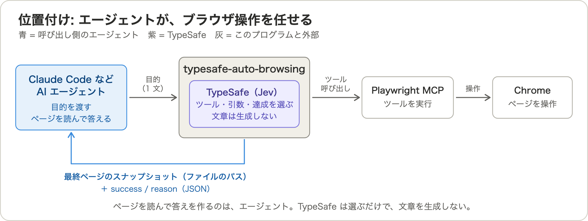


上は Claude Code から呼んだ例です。横浜から青森までの最短所要時間(3 時間 25 分)を、最終ページを読んだ Claude Code が返しています。

## 計測の設定

比べたのは次の 2 通りです。

- **委譲**: Claude Code → typesafe-auto-browsing → Playwright MCP。スキルで CLI を Bash から呼び、ブラウザの操作は Jev が決める
- **直結**: Claude Code → Playwright MCP。Claude Code がツールを直接呼ぶ

以下、この 2 通りを「委譲」「直結」と呼びます。

12 個の目的を、委譲と直結で各 3 回ずつ、`claude -p`(モデルは haiku、Chrome はウィンドウあり)で順番に実行しました。プロンプトごとに 3 回の中央値を取り、それを複雑度ごとに平均しています。委譲の総コストは、Claude Code の `total_cost_usd` に、CLI が返す TypeSafe の推定コスト(Jev の入力 $42 / 10 億トークン、出力は無料という公表単価から計算)を足した値です。

複雑度は、目的の達成に必要な操作の種類で 5 段階に分けました。各段階の目的文の例は次のとおりです(件数は、その段階で計測した目的の数)。

| 複雑度 | 操作 | 件数 | 目的文の例 |
|---|---|---|---|
| 1 開いて読む | URL を開いて、ページから 1 つの事実を読む | 2 | `https://pypi.org/project/requests/ を開いて、最新バージョンを教えて` |
| 2 開いて比べる | URL を開いて、並んだ項目を比べて 1 つを選ぶ | 2 | `https://news.ycombinator.com/ で一番ポイントが多い記事のタイトルを教えて` |
| 3 検索して読む | 検索語を入力して記事を開き、事実を読む | 3 | `https://ja.wikipedia.org/ で 東京タワー を検索して、高さを教えて` |
| 4 選んで辿る | 一覧の順位で 1 つを選び、番組ページ、最新エピソード、「詳細を見る」と辿って 2 つの値を読む | 1 | `https://tver.jp/ をひらく、再生数上位の名作ドラマの9位の番組を選び、最新エピソードの「詳細を見る」を開いて、番組内容と出演者をおしえて` |
| 5 入力して比べる | 2 つ以上の入力をして、結果を比べる | 4 | `https://transit.yahoo.co.jp/ で横浜から青森までを検索して、一番所要時間が短い経路の所要時間を教えて` |

複雑度 5 の残り 3 件は、Yahoo 乗換案内で東京から大阪までの最安料金を探す目的、同じく横浜から青森までを検索するだけの目的、Amazon で最安の USB-C ケーブルを探す目的です。4 件のうち 3 件が Yahoo 乗換案内なので、サイトの影響も含まれます。計測では、委譲のプロンプトの先頭に「typesafe-auto-browsing をつかって、」、直結には「playwright-mcp をつかって、」を付けました。

この分類は計測のあとに付けています。4 と 5 の順序も、計測のあとに入れ替えました。

## 結果

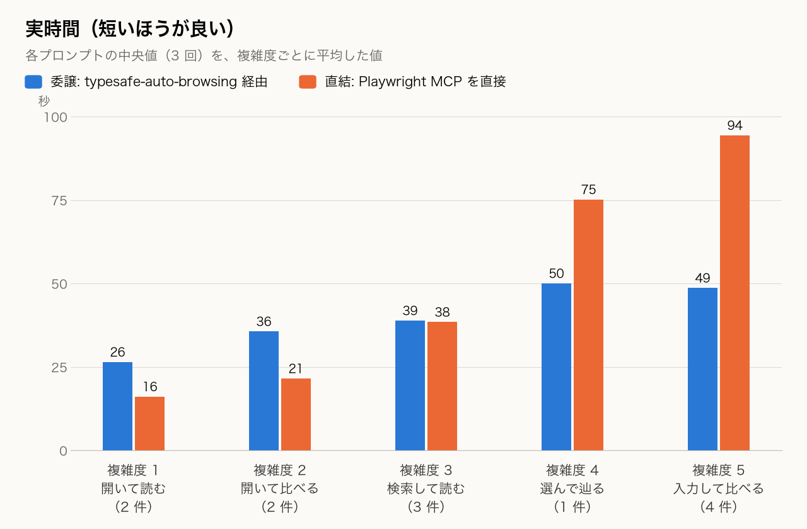

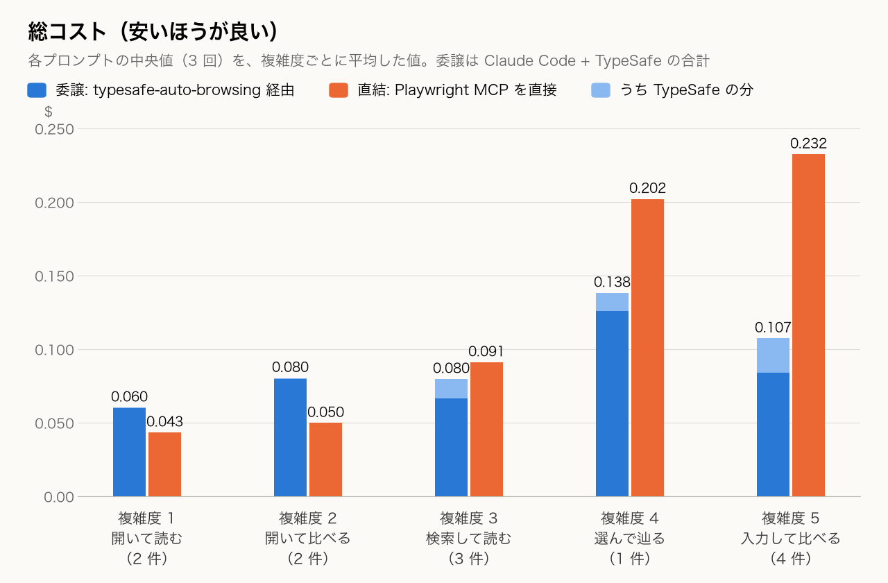

複雑度 1 では直結が速く安くなりました。実時間は委譲が 26.4 秒、直結が 16.1 秒。コストは委譲が $0.060、直結が $0.043 です。委譲に含まれる Jev の分は $0.0006 で、コストの 1% にすぎません。高いのは Claude Code の側です。スキルを読み、Bash で前提を 2 回確かめ、CLI を実行し、スナップショットを Read する。目的が単純でも、この 6〜7 ターンは省けず、約 $0.06 と 25 秒がかかります。

複雑度 3 で時間は並びます(委譲 38.9 秒、直結 38.4 秒)。コストは直結が 14% 高い($0.091 対 $0.080)ものの、プロンプトごとに見ると 1 をまたぎます。`wikipedia-eiffel-year` は直結が 17% 安く、`wikipedia-tokyo-tower-height` は直結が 40% 高くなりました。

複雑度 5 では差が開きます。実時間は委譲が 48.6 秒、直結が 94.4 秒。コストは委譲が $0.107、直結が $0.232 でした。

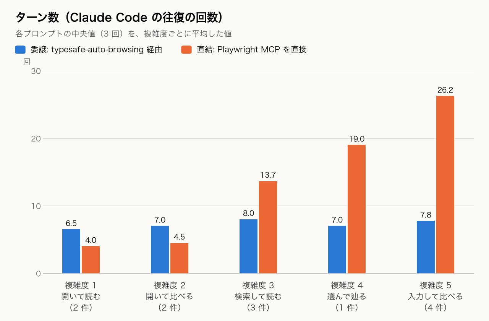

原因はターン数に出ています。直結は複雑度 1 の 4.0 から 5 の 26.2 まで増えました。委譲は 6.5 から 7.8 で、ほぼ横ばいです。委譲で増えるのは Jev の分で、コストに占める割合は複雑度 1 から順に 1%、1%、16%、9%、22% でした。直結のターンが 13 前後を超えるあたり(複雑度 3)から、委譲の固定の手順と釣り合い始めます。

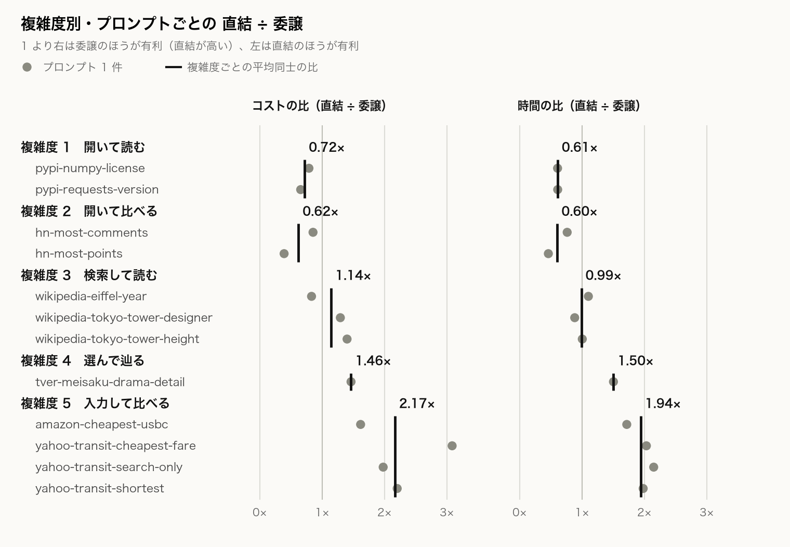

プロンプトごとの差は小さくありません。複雑度 5 のコストの直結÷委譲は、`amazon-cheapest-usbc` が 1.62、`yahoo-transit-cheapest-fare` が 3.08 でした。

複雑度 4(TVer)は 1 件だけで、別の日(2026-09-21)に、CLI の修正後に計測しました。委譲が 50.0 秒・$0.138、直結が 75.1 秒・$0.202 で、直結÷委譲は 1.46 です。直結の 3 回の幅が大きく(50.7〜182.6 秒、12〜44 ターン)、この比はほぼ直結の遅い回で決まっています。

### 目的ごとの実時間

複雑度ごとの平均だけでは、個々の目的の時間が分かりません。全 12 件を並べます。実時間は `claude -p` の起動から終了まで、CLI の時間は typesafe-auto-browsing の起動から終了まで(Playwright MCP の起動を含む)で、いずれも 3 回の中央値です。委譲の濃い青が CLI の時間、薄い青が実時間から CLI の時間を引いた残り(Claude Code 側の手順)です。

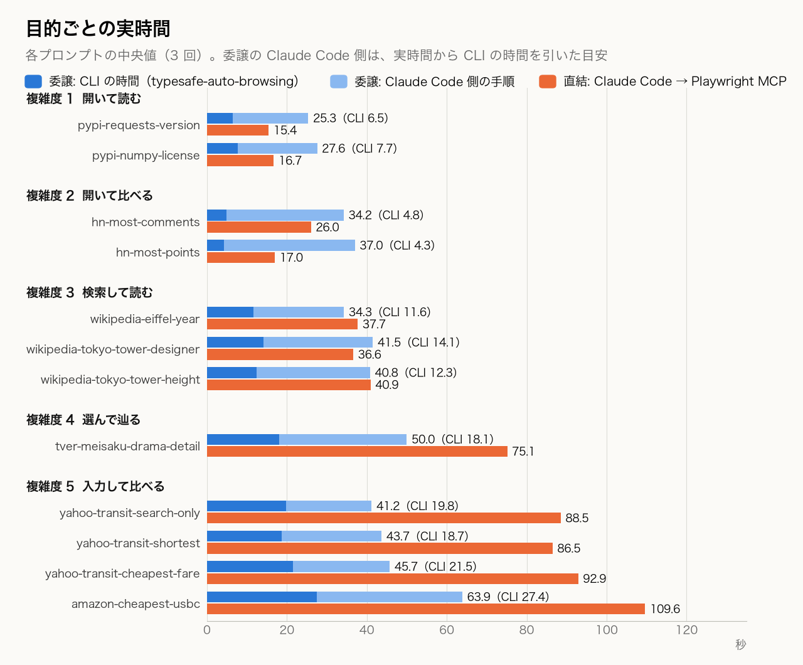

CLI 時間は、ページを開くだけの目的で 4〜8 秒、検索して読む目的で 11〜14 秒、入力や辿る操作が入る目的で 18〜27 秒でした。全 33 回(複雑度 4 を除く)を通すと中央値は 13 秒です。委譲の実時間からこの CLI 時間を引いた残りは、目的によらず約 19〜37 秒の範囲に収まります。これは、スキルを読み、前提を確認し、スナップショットを Read する、Claude Code 側の手順にあたります。中央値どうしの引き算なので目安です。操作が増えて伸びているのは、実時間のうち CLI の部分です。

### Jev の 1 判断は中央値 0.28 秒

委譲の 36 回分の実行記録から、TypeSafe へのリクエスト 1,731 件について、送ってから応答が返るまでの時間を集計しました。短い順に並べたときの位置(パーセンタイル)で示します。p90 は 90 パーセンタイル、p99 は 99 パーセンタイルの略です。

| 指標(パーセンタイル) | 意味 | 応答時間(秒) |
|---|---|---|
| 中央値(p50) | 半分のリクエストは、この時間以内に返った | 0.28 |
| p90 | 10 件のうち 9 件は、この時間以内に返った | 0.60 |
| p99 | 100 件のうち 99 件は、この時間以内に返った | 0.84 |
| 最大 | いちばん遅かった 1 件 | 1.9 |

平均は 0.35 秒でした。大半は 0.3 秒前後で返り、遅い側でも 1 秒以内に収まっています。

応答時間は各リクエストの `duration_s`(筆者の環境のネットワーク経由)で、一部のリクエストは並列に送っているため、件数を掛けた値が実行時間になるわけではありません。

### 差は単価から出ている

トークン数が減ったわけではありません。TypeSafe は、東京タワーの記事(スナップショット 644,769 文字)から設計者を探す目的で、入力を 367,610 トークン使いました。同じ目的を Claude Code(haiku、Playwright MCP 直結、4 ターン)がやったときの入力は約 12.5 万トークンで、TypeSafe のほうが多い計算です(トークナイザが違うので目安です。これは委譲と直結の計測とは別に、1 回ずつ測った値です)。それでもコストは TypeSafe が $0.0154、Claude Code が $0.0273 でした。

単価は、Jev の入力が $0.042 / 100 万トークンで出力が無料、haiku 4.5 が入力 $1、1 時間キャッシュの書き込み $2、キャッシュ読み出し $0.10、出力 $5 です。委譲のコストが緩やかにしか増えない理由の大半は、ここにあります。

### この計測で言えないこと

- 各 3 回の中央値で、1 日分(複雑度 4 は別の日)です。同じ直結の複雑度 4 でも、同日の別セットでは中央値が $0.458 と $0.202 に分かれました。
- 失敗した回は中央値に入れず、リトライしています。複雑度 4 の委譲は、CLI の修正前に 5 回中 2 回失敗しました。表の値は成功した回だけです。
- 答えの正しさは採点していません。Amazon では委譲が 3 回とも ¥29 の商品、直結が ¥551、¥551、¥749 の商品を返しましたが、配送料を含めて「一番安い」かどうかは確かめていません。TVer の複雑度 4 は、順位が日で動くので判定できませんでした。
- モデルは haiku だけです。Claude Code がサブエージェントに Playwright MCP を任せる構成とは比べていません。
- プロンプトの先頭に「typesafe-auto-browsing をつかって、」を付けています。複雑さを見て Claude Code が CLI に委譲するかどうかは、測っていません。

## 判断と確率でブラウザを自動操作する方法

Jev へのリクエストは毎回独立しています。前のステップの情報は、`history` に入れた「実行した操作」の短い文字列だけで渡します。ツールの出力やページの内容は入りません。複雑度が上がっても委譲のターン数が増えないのは、Claude Code から見ると CLI 呼び出しが 1 回のままだからだと考えています。その内側で、Jev へのリクエストは 1 実行あたり 3 回から 121 回まで増えます。

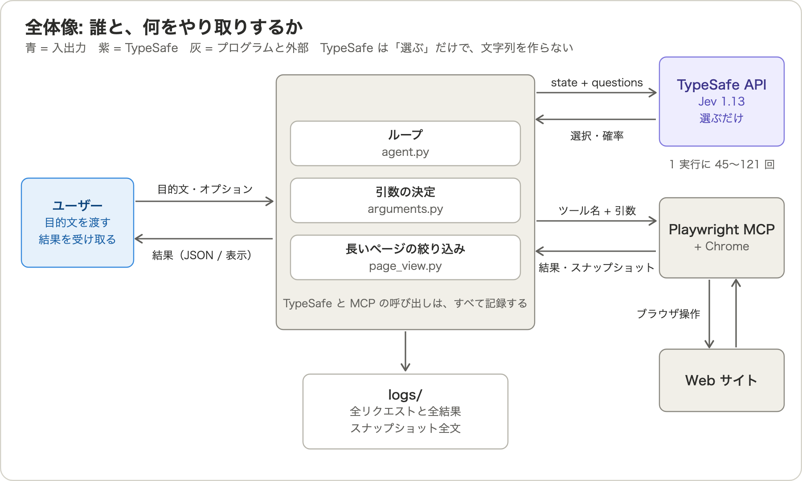

設計の前提は 3 つです。Jev は選ぶだけで、文字列を作りません。引数の値は、目的文にある文字列かページにある文字列で、選ばれたものをコードがそのまま写します。ページにも目的文にもない文字列が入力されることはありません。選択肢はツールの `input_schema` とページから機械的に作るので、ツールごとのコードはなく、Playwright MCP にツールが増えてもコードを足さずに使えます。記録は省略せず、Jev への全リクエストと全応答、MCP の全呼び出しと全結果を JSONL に残します。

### 1 ステップの流れ

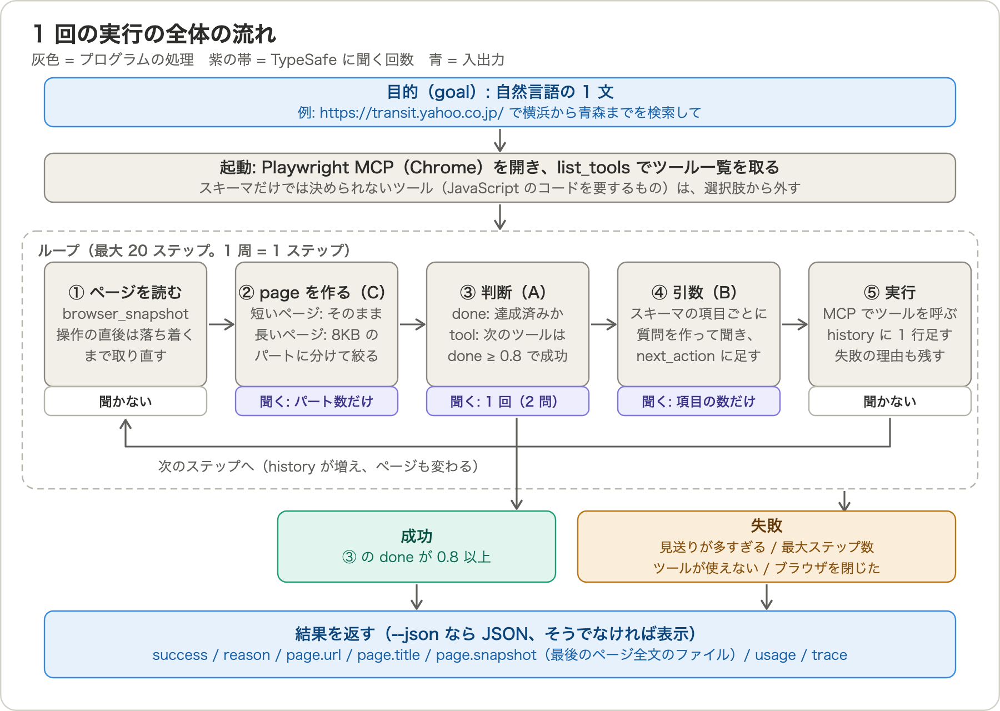

1 ステップは、ページのスナップショットを取り、Jev に「目的は達成済みか」(`done`)と「次に呼ぶツール」(`tool`)を選ばせ、選ばれたツールの引数を決めて、実行するところまでです。`done` が 0.8 以上なら成功で終わります。最大 20 ステップで、超えれば失敗です。

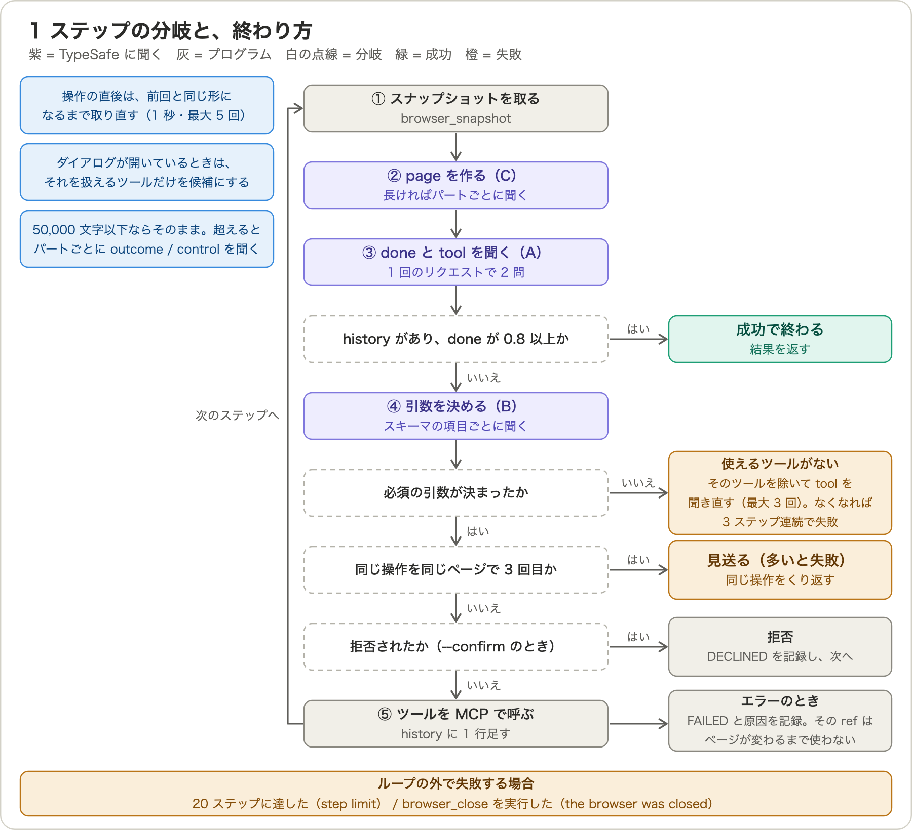

`tool` の選択肢は、Playwright MCP の `list_tools` の結果をそのまま使います。説明もツール自身の `description` です。JavaScript のコードが必須の引数を持つツール(`browser_evaluate` など)だけは、Jev が書けないので起動時に外します。

```json
"tool": {
  "type": "choice",
  "instructions": "Which browser tool should be called next to make progress toward `goal`, given `history` and the current `page`?",
  "criteria": {
    "browser_close": "Close the page",
    "browser_resize": "Resize the browser window",
    "…": "…（24 個）"
  }
}
```

### 引数はスキーマの項目ごとに質問にする

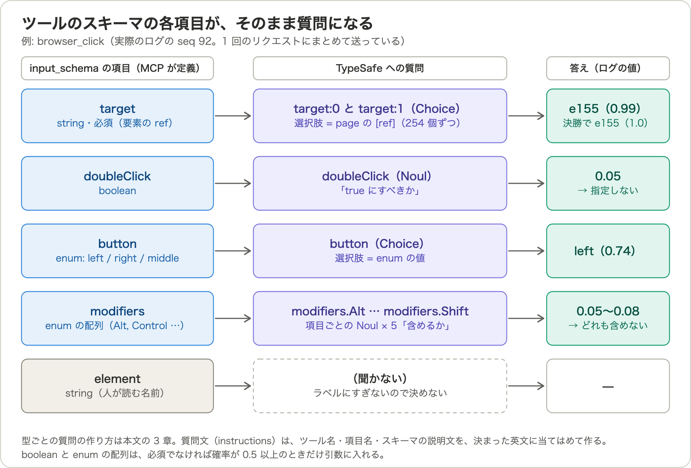

引数の質問はコードに書いていません。ツールの `input_schema` の項目を型で振り分けます。`[ref]` を取る項目はページの要素番号を選ぶ Choice、`boolean` は Noul(はい／いいえの確率)、`enum` はその値から選ぶ Choice、文字列と数値は「目的文の断片」と「ページの名前」から選ぶ Choice、になります。

文字列の候補は、目的文を同じ種類の文字が続く範囲(語)に切り、隣り合う語のあらゆる連続範囲を作って出します。`https://www.amazon.co.jp/ で一番やすいusb-cケーブルをさがして` は 7 語なので、7×8/2 = 28 個です。

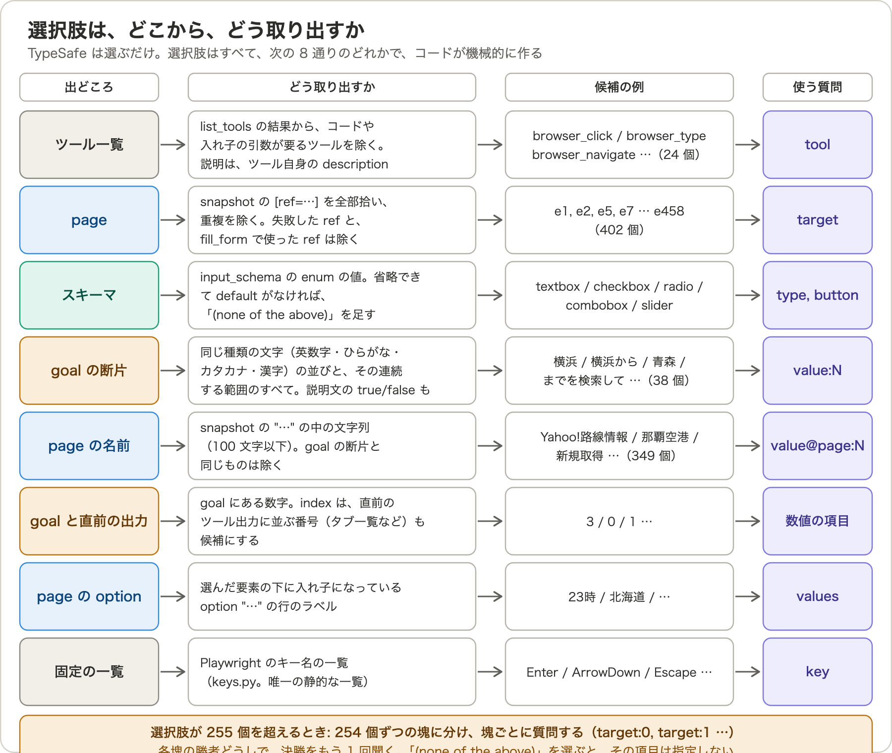

Amazon の検索語は、この 28 個から `usb-cケーブル`(0.60)が選ばれました。`一番やすいusb-cケーブル`(0.14)や `usb-c`(0.07)ではありません。「一番やすい」は検索語ではなく指示だ、という区別を、コードは持っていません。Jev が選んでいます。後段で並べ替えの選択肢 `価格: 安い順`(0.99)を選んだのも、目的文の「やすい」との対応を含めて Jev の判断で、コードにその対応表はありません。

`browser_fill_form` のように配列の引数を持つツールは、1 項目ずつ同じ質問を繰り返し、間に「もう 1 項目要るか」(`more`)を挟みます。決まった値を `next_action` に足しながら聞くので、あとの質問は前の答えを知った状態で選べます。

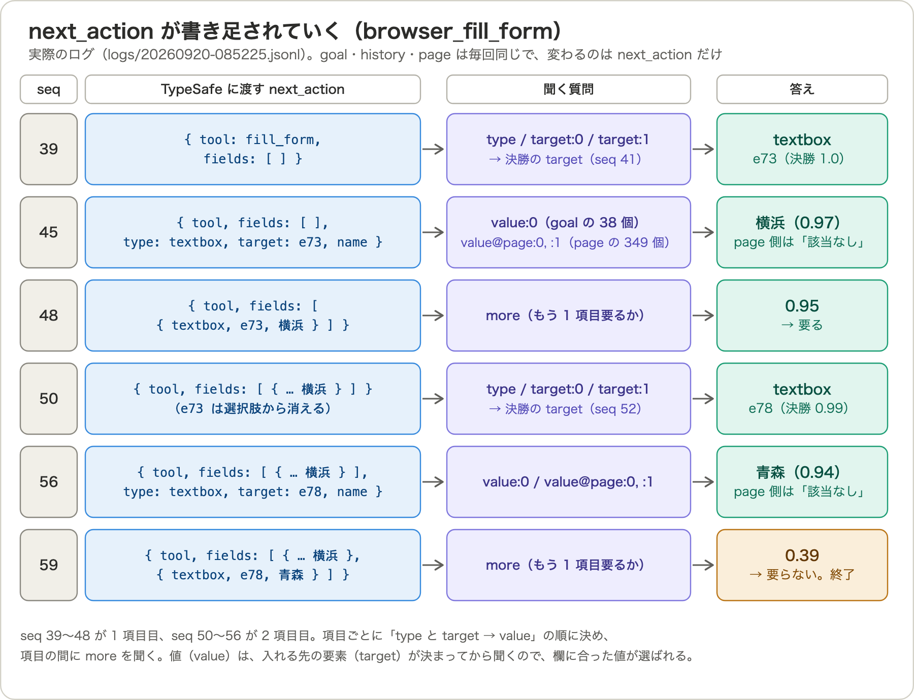

`[ref]` の候補が 255 個を超えると 1 つの Choice に入らないため、254 個ずつの塊に分けて聞き、各塊の勝者だけで決勝をもう 1 回聞きます。

### 長いページは切って聞く

Jev が一度に読めるのは約 32k トークンです。スナップショットが 50,000 文字を超えるページは、約 8,000 文字ずつのパートに切り、パートごとに「結果があるか」(`outcome`)と「操作する部品があるか」(`control`)を別リクエストで聞きます。同時に 8 本です。確率の高いパートから 50,000 文字に収まるまで採用し、つなげたものを `page` にします。

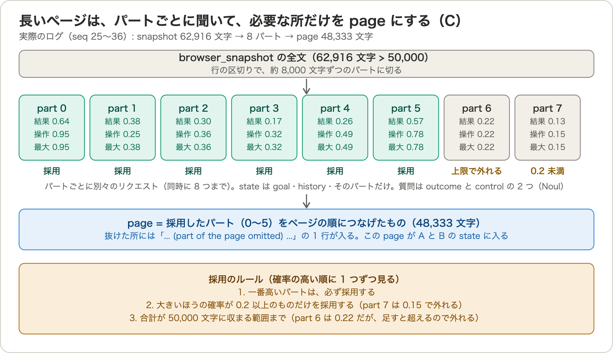

東京タワーの記事は 75 回、Amazon の検索結果は 52 回聞きます。リクエスト数が多いのはここが原因で、Amazon の 1 実行では 121 回のうち 110 回(91%)、入力トークンの 69% が、この絞り込みでした。

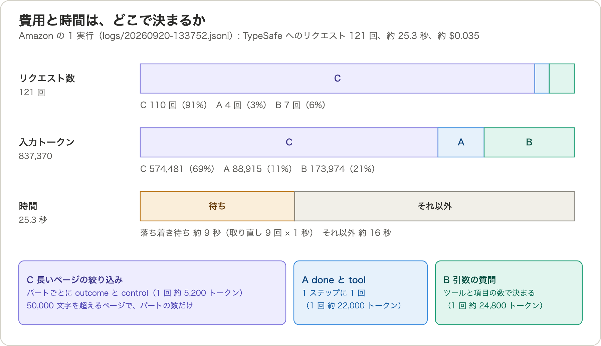

絞り込みが決め手になっているとは言えません。検索結果のページでは、52 パートのうち 38 個が 0.8 以上で、採用は確率のわずかな差と 50,000 文字の上限で決まっています。対策は入れていません。

### 実例: Amazon で最安の USB-C ケーブルを探す

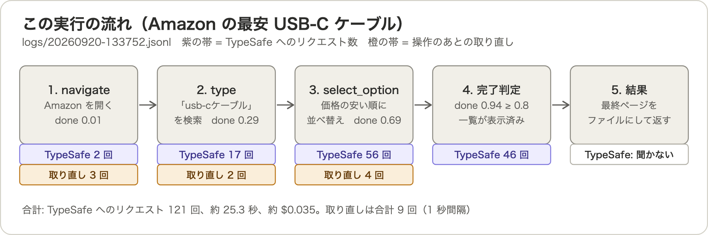

`https://www.amazon.co.jp/ で一番やすいusb-cケーブルをさがして` は、`browser_navigate`(URL を開く)、`browser_type`(検索語を入れて送信)、`browser_select_option`(並べ替えを「価格: 安い順」に)の 3 操作と、最後の完了判定で終わりました(この実行は約 25 秒、Jev へのリクエスト 121 回、約 $0.035、`done` は 0.94)。「並べ替えは価格の安い順」という手順は、コードにも目的文にもありません。ページに選択肢があり、Jev が選んだだけです。別のサイトで同じ選択肢がなければ成立しません。

`browser_select_option` は、操作のあとに待たずに戻ります。直後のスナップショットは商品一覧が空の 26,204 文字で、取り直さずに `done` を聞くと、一覧のないページで達成と判断してしまいます。そこで、ページを変える操作のあとは、スナップショットが前回と同じ形になるまで 1 秒間隔で最大 5 回取り直しています。比べるときは `[ref=…]` と数字を無視します。この処理を入れる前の実行(13:14)は、一覧が空のページを返していました。

ほかに、同じページで同じ呼び出しが 3 回目になったら実行を見送って別の手を選ばせる処理があります。`browser_navigate` の URL は、目的文に書かれたものしか選べません。`--confirm` を付けると、ページを変える操作の前にツール名と引数を表示して y/n を聞きます。

Jev が何を選んだかは、記録から確率つきで読めます。

```sh
jq -c 'select(.kind=="typesafe_response") | .response.answers' ~/.typesafe-auto-browsing/logs/<日時>.jsonl
```

## 設計上の制約

たとえば、次の依頼を考えます。

> Hacker News のトップ 15 件の順位・タイトル・points・コメント数を取得し、コメント数の上位 3 件について、最初の 10 コメントから繰り返し登場する技術名・製品名を抽出して、3 記事に共通するキーワードを報告して。取れなかった情報は推測しないこと。

現在の typesafe-auto-browsing に、これをそのまま渡すことはできません。

| 依頼の要素 | 現在の実装 | なぜそうなっているか |
|---|---|---|
| 120 文字を超える指示(この例は約 500 字) | 目的文は 120 文字まで。超えると実行前にエラーで止まる | 値の候補を、目的文の隣り合う語のあらゆる連続範囲から作るので、候補の数が語数の 2 乗で増える。約 1,400 個を超えると Jev の文脈(約 32k トークン)に入らず、API が `max_tokens_exceeded` を返す。候補はページ由来ではないので、ページを半分にしても直らない。日本語の文で 165 文字が通り 175 文字が失敗した実測から、120 文字を上限にした |
| 15 件の一覧を覚えておく | 記憶がない。前の操作は `history` の短い文字列でしか渡らない | Jev へのリクエストは毎回独立していて、渡すのは目的・履歴・ページなど 6 つのキーだけ。履歴には「何をしたか」だけを入れ、ツールの出力は入れない。Jev が一度に読めるのは約 32k トークンで、毎回ページ(最大 50,000 文字)を入れるので、出力を積み上げる余地が小さいためだと考えている |
| コメント数の上位 3 件を選ぶ | 順位づけや比較の処理がない。複雑度 2 の「一番ポイントが多い記事」でも、CLI はページを開いて終わり、最大を見つけたのは Claude Code | Jev の出力は、選択肢から選んだ 1 つと、はい／いいえの確率だけ。値の大小を計算して並べ替える形式がない。CLI 側にも、数値を扱う処理はない |
| コメントからの抽出、表記揺れの統合、共通キーワードの報告 | 文章の生成も分析もできない。返るのは最終ページだけ | Jev は文章を生成しない。CLI の担当は「目的のページに着く」までで、ページの内容を読み取る処理を持たない。読んで答えるのは呼び出し側 |
| ページ構造が違ったら方針を変える | ステップごとにページを読み直して、次のツールを選び直す。同じページで同じ呼び出しが 3 回目になると、実行せずに見送って別の手を選ばせる。見送りが 3 回を超えると、`stuck: …` で失敗を返す。ない処理は、目的や手順の全体を組み替える判断と、諦めて「取得できなかった」と報告する判断 | 各ステップの判断は、そのときの目的・履歴・ページからツールを選ぶだけで、計画を持たない。見送りは、`history` に `SKIPPED` と理由を足し、失敗した要素やツールを候補から外して、Jev に別のツールや要素を選び直させるだけの処理。終了条件は固定(`done` が 0.8 以上、見送りが 3 回を超えた、20 ステップに達した、など) |

どれも不具合ではなく、Jev が選ぶだけで文章を作らず、コードが選択肢を機械的に作る、という設計から来ています。複数の値を求める目的で、必要な情報が揃わないまま成功と判断することもあります。同じ呼び出しを見送る修正(#10)を入れたときの確認で、TVer の目的を 5 回動かしたうち 2 回、この誤判定が出ました。

## Claude Code との協調で制約を補う

ここから先は、実装も検証もしていない案です。

前の節の制約は、Jev 側で無理に解決しなくても、Claude Code との協調で補える可能性があります。Claude Code は、記憶を持ち、計算し、文章を書き、状況を見て方針を変えられます。Jev と CLI が受け持つのは、その手前の「目的のページに着く」までです。今の Skill が教えているのは CLI の呼び方と結果の読み方だけなので、協力の仕方をもう一歩踏み込んで書ける余地があります。

HN の依頼なら、Claude Code が司令塔になって、段階ごとに CLI を呼ぶ形が考えられます。

1. トップページを開く(CLI)。スナップショットから、Claude Code が 15 件の表を作る。
2. コメント数の上位 3 件を Claude Code が選ぶ。
3. 3 記事を、URL を目的文に書いて 1 件ずつ開く(CLI)。Claude Code がコメントを読んで、キーワードを抽出する。
4. Claude Code が 3 記事を比べて報告する。

120 文字の上限と、記憶がない点は、Claude Code が依頼を段階に分け、段階の間の情報をファイルに残せば避けられそうです。HN のスナップショットには各記事のリンク先(`/url: item?id=49775499` など)が入っているので、Claude Code が ID を拾って、次の段階の目的文に URL を書けます。Jev は文字列を作れませんが、目的文を書く側が Claude Code なら、URL を含まない依頼を補って渡せる可能性があります。計測の依頼はすべて URL 入りでしたが、別に「Yahooで横浜から青森までを検索して」を、現行の SKILL のまま haiku の Claude Code に 3 回頼みました。3 回とも `https://transit.yahoo.co.jp/ で横浜から青森までを検索して…` の形の目的文を作って CLI を呼び、成功しています。ただし 1 件・3 回だけの確認です。3 回のうち 2 回は、依頼にない「最短の所要時間を教えて」などを Claude Code が目的文に足していました。

順位づけ、コメントからの抽出、表記の統合、共通キーワードの報告は、CLI が返す最終ページを Claude Code が読んで行います。複雑度 2 の「一番ポイントが多い記事」でも、最大を見つけているのは今すでに Claude Code です。

失敗や誤判定への対応も、Claude Code 側に置けます。CLI は失敗したときも、`success` が偽の JSON と、最後に読めたページを返します。`success` が真でも答えが正しいとは限らず、複数の値を求める目的では誤って成功と判断することがあります。Claude Code が最終ページに必要な値があるかを確かめ、なければ目的文を直して再実行する手順を Skill に書ければ、Jev の判断の弱いところを補えるかもしれません。今の Skill にも、探した値が見つからないときは推測せず、再実行するか見つからなかったと報告する、という指示はあります。これを、段階ごとの検証に広げるイメージです。

ただし、この分け方では段階 3 が「URL が分かっていて、開いて読むだけ」の目的になります。複雑度 1 の計測で直結が速く安かった、まさにその型で、CLI を 3 回呼べば固定の約 $0.06 と 25 秒が 3 回かかります。試していないので推測ですが、Playwright を直接使ったほうが安いはずです。協調の中身には、分割の手順だけでなく、どの段階を CLI に任せるかの基準も要ると考えています。URL が分かっていて開いて読むだけの段階は Playwright を直接使い、検索する、入力する、一覧から選んで辿る、といった手数の多い段階だけを CLI に渡す。この基準は、直結のターンが 13 前後を超えたあたりから委譲が有利になった、という計測の結果から起こせないか、というのが今の見立てです。

そのほかに、次のことも未検証です。実行ごとに `TYPESAFE_AUTO_BROWSING_HOME` を分ければ、Chrome のプロファイルの衝突を避けて並列に実行できるかもしれません(ログイン状態は共有されません)。正答率の採点、サブエージェント経由の構成との比較、haiku 以外のモデルでの計測、スキルの前提確認を減らして複雑度 1 の固定費がどれだけ下がるかも、まだ測っていません。
