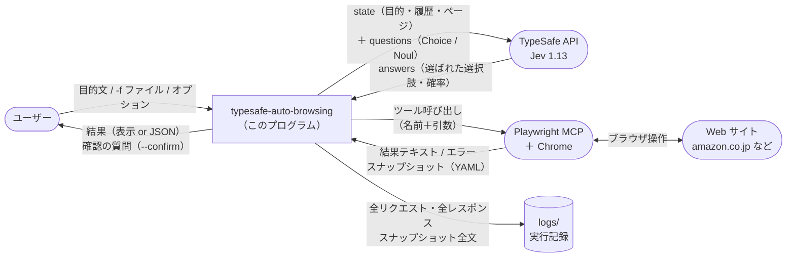
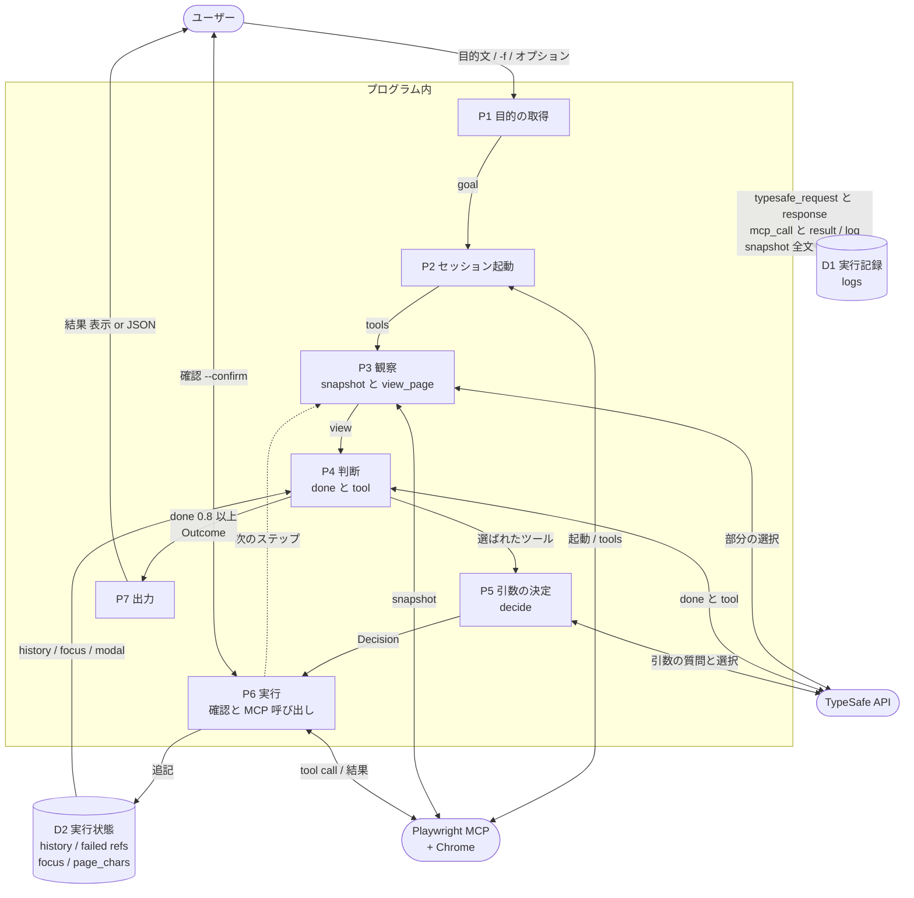
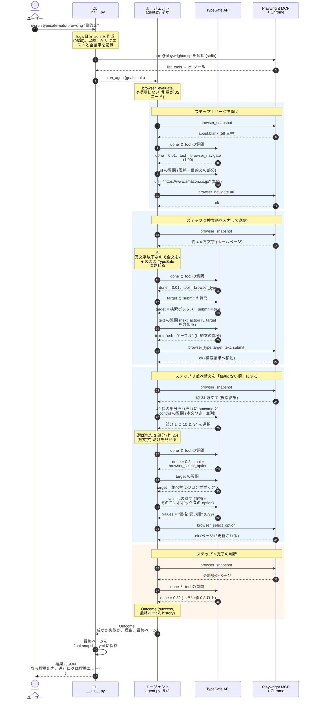
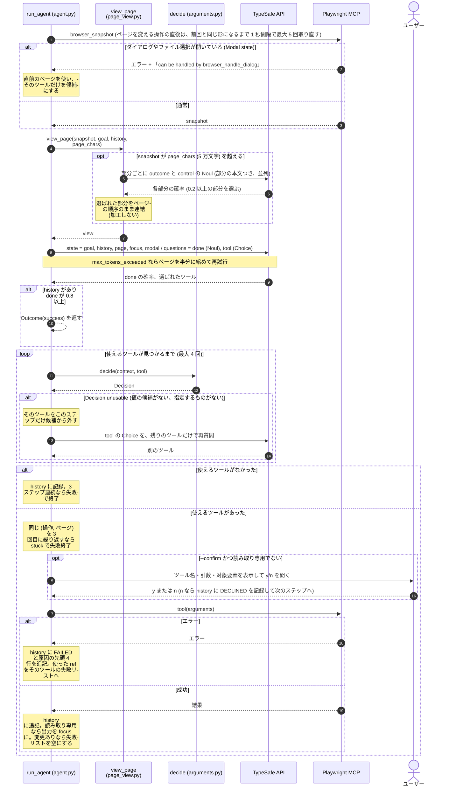
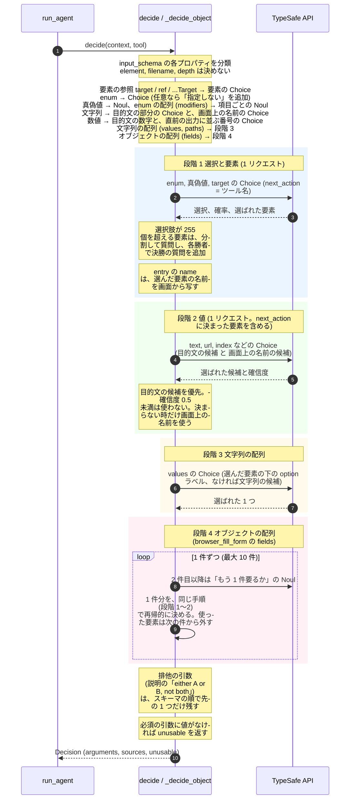

# 処理の流れ（データフロー図とシーケンス図）

`uv run typesafe-auto-browsing "https://www.amazon.co.jp/ で一番やすいusb-cケーブルをさがして"` のように渡した目的（プロンプト）が、どのように処理されるかをまとめます。図は [Mermaid](https://mermaid.js.org/) で書いてあり、GitHub などでそのまま描画されます。

- 図の数値（リクエスト数、文字数、確率）は、実際の実行記録（`logs/*.jsonl`）から取ったものです。ページの状態によって実行ごとに変わります。
- 関数名・定数名は現在のコードのものです（`src/typesafe_auto_browsing/`）。
- TypeSafe に渡す state と question が、何の情報からどう組み立てられるか（選択肢の取り出し方を含む）は、[state-and-questions.md](state-and-questions.md) にまとめてあります。

## 1. 全体像

このプログラムの原則は 1 つです。**TypeSafe（Jev）は選ぶだけで、文字列を生成しない。コードが選ばれたものをそのまま写す。**

Chrome の操作は Playwright MCP に任せ、次の判断をすべて TypeSafe の Choice（選択肢から 1 つ）と Noul（はい／いいえの確率）で行います。

| 判断 | 質問の種類 | 例（Amazon の目的） |
|---|---|---|
| 目的は達成済みか | Noul `done` | 0.01 → … → 0.82 |
| 次に呼ぶツール | Choice `tool` | `browser_navigate` → `browser_type` → `browser_select_option` |
| ツールの引数 | Choice / Noul | `url = 'https://www.amazon.co.jp/'`、`text = 'usb-cケーブル'`、`values = ['価格: 安い順']` |
| 長いページのどこを読むか | 部分ごとの Noul `outcome` / `control` | 42 個の部分のうち 3 つ |

処理は 3 つの段階に分かれます。

1. **起動**: 目的を読み、Playwright MCP を起動してツール一覧を取得する。
2. **観察 → 判断 → 実行のループ**: 目的が達成されたと判断するまで繰り返す（最大 20 ステップ）。
3. **出力**: 結果を人向けの表示、または `--json` の JSON で出す。最終ページのスナップショットは、全文をファイルにして、そのパスを返す（答えは作らない。読むのは呼び出し側）。

すべての TypeSafe への入出力と MCP の呼び出しは、`logs/<日時>.jsonl`（と、大きなスナップショットの別ファイル）に省略なしで記録されます。

## 2. データフロー図

### 2.1 コンテキスト図（システムと外部の関係）



### 2.2 レベル 1（プロセスとデータストア）



- 実線がデータの流れです。点線は、ループの次のステップへの戻りと、記録（D1）への書き込みです（すべてのプロセスが記録します）。
- P3 の `snapshot` は MCP から受け取り、全文を D1 にも保存します。
- TypeSafe へのリクエストはすべて `MeteredClient.system_one`、MCP の呼び出しはすべて `agent._call_and_trace` を通るので、記録は 2 か所で行われます。

### 2.3 データ辞書

| データ | 形式 | 作る所 | 使う所 |
|---|---|---|---|
| `goal` | 文字列（例: `https://www.amazon.co.jp/ で一番やすい…`） | P1（引数、または `-f` のファイル。`#` 行はコメント） | 全 TypeSafe リクエストの `state.goal`、引数の候補の元 |
| `tools` | MCP のツール 25 個（name, description, input_schema, annotations） | P2（`list_tools`） | P4 の選択肢、P5 の引数の決め方の根拠 |
| `snapshot` | Playwright MCP の YAML（要素・`[ref=eN]`・リンクの `/url:`） | P3（`browser_snapshot`） | P3（ページビュー）、P7（最終ページのファイル）、D1 |
| `view` | snapshot 全体、または選ばれた約 8,000 文字の部分の連結 | P3（`view_page`） | P4・P5 の `state.page` |
| `state` | `{goal, history, page, [focus], [modal], [next_action]}` | P3〜P5（`build_state`） | TypeSafe（32k トークンまで。超えたらページを半分に縮めて再試行） |
| `questions` | Choice（選択肢は最大 255 個＋「該当なし」）と Noul | P3〜P5 | TypeSafe |
| `answers` | Choice: 選ばれた選択肢・確信度・全選択肢の確率 / Noul: 確率 | TypeSafe | P3〜P5 |
| `Decision` | `arguments`（ツールの引数）、`sources`（goal / page / list / schema）、`unusable`（使えない理由） | P5（`decide`） | P4 の再選択、P6 |
| `history` | 実行したツール呼び出しの文字列。失敗は `-> FAILED: 原因の先頭 4 行`、拒否は `-> DECLINED by the user` | P6 | 次のステップの `state.history` |
| `focus` | 読み取り専用ツール（`browser_snapshot` の `target` 指定など）の出力（最大 8,000 文字） | P6 | 次のステップの `state.focus` |
| `Outcome` | `success`、`reason`、最終ページ、`history` | P4（done 0.8 以上で作る。失敗のときも、最後に読めたページを入れる） | P7 |
| 実行記録 | 1 行 1 イベントの JSON（`typesafe_request`、`typesafe_response`、`mcp_call`、`mcp_result`、`log`、`page_view`、`outcome` など） | `Trace` | 調査（`jq` など） |

## 3. シーケンス図

### 3.1 全体（Amazon の目的）

実行記録から起こした、典型的な流れです。エージェントの中の細かい動き（ページビュー、引数の決定）は 3.2〜3.3 で説明します。



- この記録の実行では、操作のループが TypeSafe へのリクエスト 13 回でした。答えの段階（この記録には 58 回ありました）は、今はありません。
- 実際の実行では、この図にない操作が入ることがあります。この記録では、ステップ 1 と 2 の間に、ページの読み込み前のスナップショットを見て、ホームページ上の要素を 1 回クリックしています。図はそれを省いた、目的にまっすぐ向かう流れです。
- ステップ 3 のあと、ページ更新の途中のスナップショットが取れて、ステップ 4 で別の操作が選ばれることもあります。その場合もループは同じ手順で続きます。

### 3.2 1 ステップの詳細（ループの中身）

`agent.run_agent` の 1 回分です。



### 3.3 引数の決定（`decide`）

ツールの `input_schema` だけを根拠に、TypeSafe が引数を選びます。段階に分けて聞くのは、「入力する文字列は、入力先の要素が決まってから決める」ためです。



## 4. 出力

- **既定**: `Done: goal achieved (p=0.82)` に続けて、最終ページのスナップショットのパス（`Snapshot: …`）と使用量（TypeSafe のリクエスト数・トークン数・推定コスト）を表示します。
- **`--json`**: 進行のログは標準エラーに出し、標準出力には次の JSON だけを出します。

```json
{
  "goal": "https://www.amazon.co.jp/ で一番やすいusb-cケーブルをさがして",
  "success": true,
  "reason": "goal achieved (p=0.82)",
  "page": {
    "url": "https://www.amazon.co.jp/s?k=…&s=price-asc-rank",
    "title": "Amazon.co.jp : usb-cケーブル",
    "snapshot": "/Users/…/logs/20260919-201541/final-snapshot.yml"
  },
  "usage": {"requests": 13, "input_tokens": 0, "output_tokens": 0, "cost_usd": 0.0},
  "trace": "logs/20260919-201541.jsonl"
}
```

- `success` と `reason` が、成功か失敗かとその理由です。終了コードも、成功が 0、失敗が 1 です。
- `page.snapshot` は、最後に読めたページの `browser_snapshot` の出力全文の絶対パスです。失敗したときも、読めたページがあれば入ります。読めたページがない失敗は `null` です。
- 例外で落ちたときも、`--json` なら `success: false`、`reason: "error: …"` の JSON を出します（`usage` は `null`）。

## 5. コードとの対応

| モジュール | 役割 | 主な関数・クラス |
|---|---|---|
| `__init__.py` | CLI。引数と `-f` の読み取り、起動、出力、最終ページの保存 | `main`, `_run`, `_read_goal`, `goal_from_file`, `_confirm`, `_save_snapshot`, `_result_json` |
| `playwright_mcp.py` | Playwright MCP の起動と呼び出し | `playwright_session`, `call_tool` |
| `agent.py` | 観察 → 判断 → 実行のループ | `run_agent`, `_call_and_trace` |
| `page_view.py` | 長いページの部分選択 | `view_page`, `split_parts`, `describe_part` |
| `arguments.py` | ツールの引数の決定（スキーマ駆動） | `decide`, `_decide_object`, `ask_picks`, `ask_fitting_page`, `goal_candidates`, `unusable_reason`, `modal_handlers` |
| `keys.py` | `browser_press_key` のキー名（唯一の静的リスト） | `KEYS` |
| `usage.py` | TypeSafe の入出力の記録とコスト計算 | `MeteredClient`, `Usage` |
| `trace.py` | 実行記録（`logs/`、所有者だけが読める権限） | `Trace` |

### 主な上限・しきい値

| 名前 | 値 | 意味 |
|---|---|---|
| `Settings.max_steps` | 20 | ループの最大ステップ数 |
| `Settings.done_threshold` | 0.8 | 「達成済み」とみなす `done` の確率 |
| `Settings.page_chars` | 50,000 | TypeSafe に見せるページの上限（超えたら部分選択） |
| `PART_CHARS` | 8,000 | 1 部分の大きさ |
| `MAX_OPTIONS` | 255 | 1 つの Choice の選択肢の数 |
| `MIN_CONFIDENCE` | 0.5 | 自由な文字列・数値の候補を使う最低の確信度 |
| `MAX_RETRIES` | 3 | 使えないツールを外して選び直す回数（1 ステップ内） |
| `MAX_DEAD_STEPS` | 3 | 使えるツールがないステップが連続したら失敗にする数 |
| `SETTLE_SECONDS` / `SETTLE_ATTEMPTS` | 1.0 / 5 | ページを変える操作のあと、スナップショットを取り直す間隔と回数の上限 |
| `MAX_ENTRIES` | 10 | 配列の引数（`fields`）の件数 |
| `FOCUS_CHARS` | 8,000 | 読み取り専用ツールの出力を TypeSafe に見せる上限 |

## 6. 図の確認・更新

- 図は Mermaid です。GitHub、VS Code の Markdown プレビュー（Mermaid 対応の拡張）、[Mermaid Live Editor](https://mermaid.live/) で描画できます。
- 実行記録から数値を取り直すには、`jq` が便利です。

```sh
# 種類ごとのイベント数
jq -r '.kind' logs/<日時>.jsonl | sort | uniq -c
# TypeSafe に送った質問の種類の並び
jq -c 'select(.kind=="typesafe_request") | [.seq, (.questions | keys)]' logs/<日時>.jsonl
# 操作の並び
jq -c 'select(.kind=="mcp_call" and .tool!="browser_snapshot") | [.seq, .tool, .arguments]' logs/<日時>.jsonl
```
