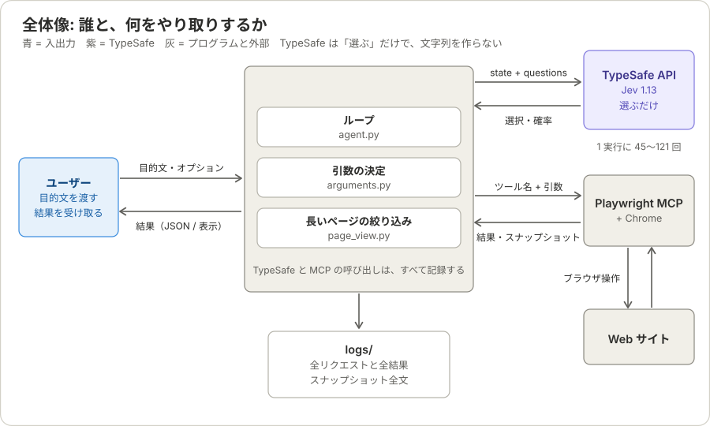
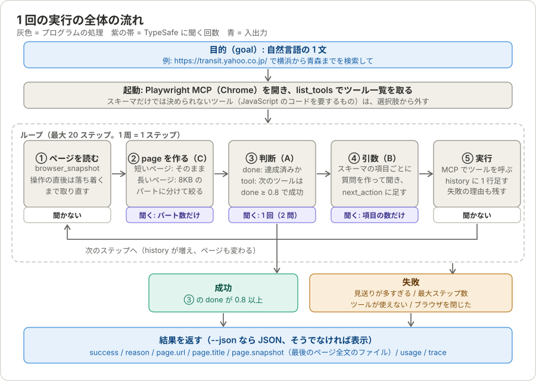
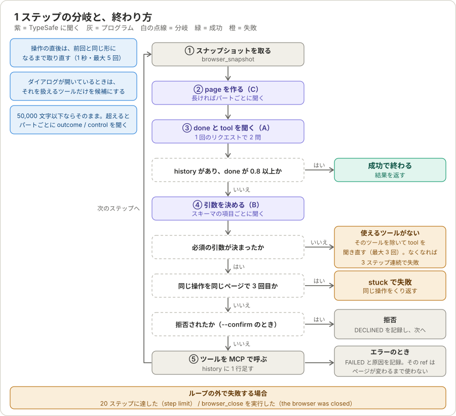
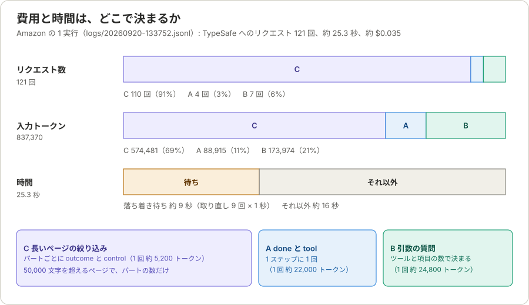

# アーキテクチャ（全体像・制御・費用・限界）

目的（プロンプト）を渡すと、Playwright MCP（Chrome）を操作して達成する CLI です。**どのツールを使うか、次に何をするか、終わったかの判断を、すべて [TypeSafe](https://docs.typesafe.ai)（Jev）に選ばせます。**

この文書は、全体を 1 枚で掴み、どこを見ればよいかが分かるようにするための入口です。

| 文書 | 役割 | 読むとき |
|---|---|---|
| この文書 | 全体像、制御、終了条件、費用、限界、調べ方 | 最初に |
| [state-and-questions.md](state-and-questions.md) | TypeSafe に渡す state と question、選択肢が、何の情報からどう作られるか | 仕組みを知りたいとき |
| [walkthrough-amazon-usbc.md](walkthrough-amazon-usbc.md) | Amazon の 1 つの目的を、実際の記録に沿って 1 ステップずつ追う | 具体例で確かめたいとき |
| [cost-comparison.md](cost-comparison.md) | Claude Code (haiku) + Playwright MCP との、1 件ごとのコスト比較（テスト方法と結果） | 費用を他と比べたいとき |

- 実行記録は、既定では `~/.typesafe-auto-browsing/logs/` に置かれます（`--log-dir` か、環境変数 `TYPESAFE_AUTO_BROWSING_HOME` で変えられます）。この文書では、その場所を `<log-dir>` と書きます。
- 数値は、実際の実行記録から取ったものです。ページの状態によって、実行ごとに変わります。
- 関数名・定数名は現在のコードのものです（`src/typesafe_auto_browsing/`）。

---

## 1. このプログラムの 3 つの原則

**① TypeSafe は選ぶだけ。文字列を作らない。**
TypeSafe が返すのは、選択肢からの選択（Choice）と、はい／いいえの確率（Noul）だけです。引数の値は、目的文にある文字列か、ページにある文字列で、コードが選ばれたものをそのまま写します。だから、ページにも目的文にもない文字列が、入力されることはありません。選択の確率は記録に残るので、あとから「なぜそれを選んだか」を調べられます。

**② 選択肢は、スキーマとページから機械的に作る。**
ツールの引数の質問は、そのツールの `input_schema` の各項目を、型に応じて質問にして作ります。ツールごとのコードはありません。だから、Playwright MCP のツールが増えても、コードを足さずに使えます。

**③ 記録は省略しない。**
TypeSafe への全リクエストと全応答、MCP の全呼び出しと全結果、スナップショットの全文を、`<log-dir>/<日時>.jsonl` と、その隣のファイルに残します。うまくいかなかったとき、原因をここから調べます（「9. うまくいかないとき」）。

なお、TypeSafe へのリクエストは、毎回独立しています。前の操作を伝えるのは、`state.history` だけです。

---

## 2. 全体像

- **TypeSafe API** には、`state`（目的、実行した操作の記録、ページ、途中経過）と `questions`（Choice と Noul）を送り、選択と確率を受け取ります。1 回の実行で、45〜121 回呼びます。
- **Playwright MCP** には、ツール名と引数を渡し、結果とスナップショット（ページの YAML）を受け取ります。
- **`<log-dir>`** には、上の 2 つとのやり取りをすべて書きます。ファイルは所有者だけが読める権限（0600、フォルダは 0700）です。

---

## 3. 1 回の実行の流れ

1. **起動:** 目的を読み、Playwright MCP を起動して、ツール一覧を取ります。
2. **ループ（最大 20 ステップ）:** ページを読む（①）→ page を作る（②）→ 判断する（③）→ 引数を決める（④）→ 実行する（⑤）を、達成か失敗まで繰り返します。
3. **結果を返す:** `success`、`reason`、最後のページの URL とタイトル、最後のスナップショット全文のファイルのパスを返します。答えは作りません。ページの内容を読むのは、呼び出し側です。

各処理で TypeSafe に何を聞くか、その state と question の作り方は、[state-and-questions.md](state-and-questions.md) の 1〜3 章にあります。

---

## 4. 1 ステップの分岐と、終わり方

- **① スナップショット:** ページを変える操作の直後は、前回と同じ形になるまで取り直します（1 秒間隔、最大 5 回）。Playwright MCP の一部のツールが、操作のあとの待ちを持たないためです（「7. 外部との境界」）。ダイアログが開いていると、スナップショットがエラーになるので、そのダイアログを扱えるツールだけを候補にします。
- **② page:** 50,000 文字以下ならそのまま、超えると、約 8,000 文字のパートごとに `outcome` と `control` を聞いて、必要なパートだけを残します。
- **③ 判断:** `done`（達成済みか）と `tool`（次のツール）を、1 回のリクエストで聞きます。`history` があり、`done` が 0.8 以上なら、成功で終わります。
- **④ 引数:** 必須の引数に選択肢がなく、決まらないツールは、そのステップだけ候補から外し、`tool` を聞き直します（最大 3 回）。
- **⑤ 実行:** 拒否（`--confirm`）、エラー、成功のいずれでも、`history` に 1 行足します。エラーのときは、使った要素（ref）を、ページが変わるまで使いません。

---

## 5. 終了と失敗の一覧

| 結果 | 条件 | `reason` | `page.snapshot` |
|---|---|---|---|
| **成功** | `history` があり、`done` が 0.8 以上（`--done-threshold`） | `goal achieved (p=0.94)` | あり |
| 失敗: 同じ操作をくり返す | 同じページで同じ呼び出しが 3 回目になると、呼ばずに見送って別の手を選ばせる。見送りが 3 回を超えた | `stuck: repeated <呼び出し>` | あり |
| 失敗: ツールが使えない | 使えるツールがないステップが、3 回続いた | `no tool could be used for 3 steps in a row (…)` | あり |
| 失敗: ツールが 1 つもない | 起動時に、選択肢にできるツールが 0 個 | `no tool can be used` | なし |
| 失敗: ブラウザが閉じた | `browser_close` を実行した | `the browser was closed` | あり |
| 失敗: ステップ数 | 20 ステップ（`--max-steps`）に達した | `step limit (20) reached` | あり |
| 失敗: 例外 | TypeSafe API のエラー、MCP の異常 | `error: …` | なし |

- どの結果でも、終了コードは、成功が 0、失敗が 1 です。
- `--json` のときは、例外で落ちた場合も、`success: false` の JSON を標準出力に出します（`usage` は `null`）。目的が空、`--confirm` を端末なしで使った、という実行前のエラーは、標準エラーに出るだけです。
- `success` は、「TypeSafe が、ページが目的の結果を示していると判断した」ことです。答えが正しいことの保証ではありません。

---

## 6. 費用と時間は、どこで決まるか

Amazon の 1 実行（TypeSafe へのリクエスト 121 回、約 25.3 秒、約 $0.035）では、**リクエストの 9 割、入力トークンの 7 割が、長いページの絞り込み（C）**でした。

- **C の回数は、ページの長さで決まります。** 50,000 文字を超えるページは、約 8,000 文字のパートごとに 1 回聞きます（425,506 文字なら 52 回）。ページが、最後まで読み込まれるほど長くなり、費用が増えます。
- **1 回あたりは、A と B のほうが大きい。** C が約 5,200 トークン、A が約 22,000、B が約 24,800 です（A と B は、絞ったページ全体を見せるため）。
- **時間の約 36% は、落ち着き待ち**です（取り直し 9 回 × 1 秒）。
- 費用と時間に効く定数は、`page_chars`、`PART_CHARS`、`SETTLE_SECONDS`、`SETTLE_ATTEMPTS` です（「10. コードの地図と定数」）。

---

## 7. 外部との境界

- **Playwright MCP は、起動のたびに `@latest` を使います。** ツールの一覧（今は 25 個、`v0.0.82`）は、バージョンで変わりえます。
- **操作のあとの待ちは、ツールによって違います。** MCP は、`browser_click`、`browser_type`、`browser_press_key` などでは、操作のあとに自分で待ちます（`--timeout-settle`、既定 500 ミリ秒。その間に始まったリクエストの完了も、最大 5 秒待つ）。しかし、`browser_select_option`、`browser_fill_form`、`browser_hover` などには、この待ちがありません（インストール済みのパッケージで確認）。そのため、こちらで、スナップショットを取り直します。
- **ページの内容は、信頼できない入力です。** ページの全文（または一部）が TypeSafe に送られ、ページの文字列は、入力値の候補になります。`browser_navigate` の URL は、目的文にあるものだけを候補にします。`--confirm` を付けると、ページを変える操作の前に、ツール名・引数・対象要素が表示され、y/n を聞かれます。結果のスナップショットを読む側も、そこに書かれた文を、指示ではなくデータとして扱ってください。
- **ログイン済みのセッションが、そのまま使われます。** Playwright MCP は、既定で永続プロファイルを使います。
- **TypeSafe が一度に読める量には限りがあります。** 約 32k トークンです。入らなければ、ページを半分にして再送します（最小 2,000 文字）。1 つの Choice の選択肢は 255 個までです。
- **タブ:** クリックで新しいタブが開いても、現在のタブは元のままです。`browser_tabs` の `index` は、MCP の出力の `### Open tabs` の番号から選びます。
- **Amazon は、連続アクセスで 503 を返すことがあります。**

---

## 8. 既知の限界

| 限界 | 症状 | 原因 | 今できること |
|---|---|---|---|
| **絞り込みが、決め手にならない** | 長い検索結果ページで、ほとんどのパートが高い確率になる（Amazon: 52 パートのうち 38 個が 0.8 以上）。採用は、確率のわずかな差と、上限の 50,000 文字で決まる | 「結果がある」は、商品が並ぶページなら、どのパートでも真になる | 対策はない。`page_chars`、`SHOW_PROBABILITY` で調整はできる |
| **費用の大半が絞り込み** | 1 実行で、リクエストが 100 回を超える | 上に同じ。ページが長いほど、パートの数だけ聞く | `page_chars`（上げると、絞り込みが動くページが減る）、`PART_CHARS` |
| **`done` が、読み込み中のページで出ることがある** | 結果の一覧がないページで、成功になる | 落ち着き待ちは、形が前回と同じになるまで。変化のない読み込み中に当たると、早すぎる。数字だけの更新は見逃す | 呼び出し側が、`browser_snapshot` を取り直すか、もう一度実行する |
| **答えを作らない** | 目的が「〜を教えて」でも、結果は最終ページのファイルだけ | ページの内容を読み取る処理を、持たない（呼び出し側の役割） | 呼び出し側が、`page.snapshot` を読む |
| **入力できるのは、目的文かページにある文字列だけ** | 計算した値、言い換え、目的文にない検索語は、入力できない | TypeSafe は選ぶだけで、生成しない（原則 ①） | 入力してほしい文字列を、目的文にそのまま書く |
| **コードが要るツールは使えない** | `browser_evaluate` は選択肢に出ない。`browser_run_code_unsafe` は、実質使われない | 必須の引数が JavaScript のコードで、TypeSafe が書けない。`browser_find` は、検索テキストの候補（目的文・ページの名前）が合わないと、そのステップだけ外れる | なし |
| **候補の数は、目的文の語の数の 2 乗で増える** | 目的文が長いと、`url` や `text` の選択肢が増える | 語が n 個なら、候補は n(n+1)/2 個 | 目的文を短くする。255 個を超えると、分割して聞く（リクエストが増える） |
| **選べる要素は、絞った page の中だけ** | 絞り込みで外れた部分にある要素を、操作できない | `target` の選択肢は、TypeSafe に見せた page の `[ref]` | なし（絞り込みの精度に依存） |
| **操作の成否を確かめない** | 並べ替えが効かなくても、そのまま進む | 成否の判断は、`done` に委ねている | 目的文に、確かめたい状態を書く |

---

## 9. うまくいかないとき

`<log-dir>/<日時>.jsonl` に、すべてが残っています。`<日時>` は、実行のたびに変わります。

| 症状 | 見る所 | コマンド |
|---|---|---|
| なぜ止まった、失敗した | 結果と例外 | `jq -c 'select(.kind=="outcome" or .kind=="error")' <log-dir>/<日時>.jsonl` |
| 同じ操作をくり返している | 呼んだツールと引数の並び | `jq -c 'select(.kind=="mcp_call" and .tool!="browser_snapshot") \| [.seq, .tool, .arguments]' <log-dir>/<日時>.jsonl` |
| 期待と違うツールが選ばれた | 各ステップの `tool` の確率（上位 3 つ） | `jq -c 'select(.kind=="typesafe_response" and .response.answers.tool) \| {seq, tool: .response.answers.tool.choice, top: (.response.answers.tool.probabilities \| to_entries \| sort_by(-.value) \| .[0:3] \| map({(.key): .value}) \| add)}' <log-dir>/<日時>.jsonl` |
| 期待と違う値が入った | 聞いた質問と選択肢の数、TypeSafe の答え | `jq -c 'select(.kind=="typesafe_request" and .seq==N) \| .questions \| map_values({type, options: ((.criteria // {}) \| length)})' <log-dir>/<日時>.jsonl` `jq -c 'select(.kind=="typesafe_response") \| {seq, answers: .response.answers}' <log-dir>/<日時>.jsonl` |
| 欲しい要素や価格がページにない | 取ったスナップショットの時刻と大きさ（取り直しも含む） | `jq -r 'select(.kind=="mcp_result" and .tool=="browser_snapshot") \| "\(.seq) t=\(.elapsed_s) chars=\(.chars // (.text\|length)) \(.text_file // "inline")"' <log-dir>/<日時>.jsonl` `grep -c '￥' <log-dir>/<日時>/final-snapshot.yml` |
| 費用が多い | 質問の種類ごとのリクエスト数 | `jq -r 'select(.kind=="typesafe_request") \| (.questions\|keys\|map(sub(":[0-9]+$";"")\|sub("@page$";""))\|unique\|join(","))' <log-dir>/<日時>.jsonl \| sort \| uniq -c \| sort -rn` |
| 遅い | ツールごとの所要時間 | `jq -r 'select(.kind=="mcp_result") \| "\(.seq) \(.tool) \(.duration_s)"' <log-dir>/<日時>.jsonl` |
| 長いページで、どのパートが選ばれたか | パートごとの確率 | `jq -c 'select(.kind=="page_view")' <log-dir>/<日時>.jsonl` |

`seq`（記録の通し番号）で、TypeSafe への 1 回のリクエストと、そのときの state（`typesafe_request` の `state`）を、見つけられます。state と question の中身の読み方は、[state-and-questions.md](state-and-questions.md) の 2〜4 章にあります。

---

## 10. コードの地図と定数

| モジュール | 役割 | 主な関数・クラス |
|---|---|---|
| `__init__.py` | CLI。引数と `-f` の読み取り、起動、結果の出力、最終ページの保存 | `main`, `_run`, `_read_goal`, `goal_from_file`, `_confirm`, `_save_snapshot`, `_result_json`, `_page_info` |
| `playwright_mcp.py` | Playwright MCP の起動と呼び出し | `playwright_session`, `call_tool` |
| `agent.py` | 観察 → 判断 → 実行のループ、落ち着き待ち、`done` と `tool` の質問 | `run_agent`, `_snapshot`, `_call_and_trace`, `_tool_question`, `goal_achieved` |
| `page_view.py` | 長いページの絞り込み（C） | `view_page`, `split_parts` |
| `arguments.py` | state の組み立て、ツールの引数の決定、候補の取り出し | `build_state`, `decide`, `_decide_object`, `ask_picks`, `ask_fitting_page`, `goal_candidates`, `page_names`, `options_under`, `unusable_reason`, `modal_handlers` |
| `keys.py` | `browser_press_key` のキー名（唯一の静的な一覧） | `KEYS` |
| `usage.py` | TypeSafe の入出力の記録とコスト計算 | `MeteredClient`, `Usage` |
| `trace.py` | 実行記録（`<log-dir>`） | `Trace` |

TypeSafe へのリクエストは、すべて `MeteredClient.system_one`、MCP の呼び出しは、すべて `agent._call_and_trace` を通ります。記録は、この 2 か所で行われます。

### 定数と、その効果

| 名前 | 値 | 意味 | 上げる / 下げると |
|---|---|---|---|
| `Settings.max_steps`（`--max-steps`） | 20 | ループの最大ステップ数 | 上げると長い操作ができるが、費用が増える |
| `Settings.done_threshold`（`--done-threshold`） | 0.8 | 「達成済み」とみなす `done` の確率 | 下げると早く終わるが、誤判定が増える。上げると、余計なステップが増える |
| `Settings.page_chars` | 50,000 | TypeSafe に見せるページの上限。超えると、絞り込み（C）が動く | 上げると、C が動くページが減る。窓（約 32k トークン）に入らないと、半分に縮めて再送する |
| `PART_CHARS` | 8,000 | 1 パートの大きさ | 小さくすると、C の回数が増える |
| `SHOW_PROBABILITY` | 0.2 | この確率に満たないパートは見せない（最有力の 1 つは必ず見せる） | 上げると、採用するパートが減る |
| `CONCURRENCY` | 8 | C を、同時に聞くパートの数 | 上げると速くなる。API の制限に注意 |
| `MAX_OPTIONS` | 255 | 1 つの Choice の選択肢の数（API の上限） | 超えるものは、塊に分けて聞く |
| `MIN_PAGE_CHARS` | 2,000 | ページを半分に縮めるときの下限 | — |
| `MIN_CONFIDENCE` | 0.5 | 自由な文字列・数値の候補を使う、最低の確信度 | 上げると、決まらない引数が増える |
| `MAX_NAME_CHARS` | 100 | 値の候補にする、ページの名前の最大の長さ | — |
| `MAX_ENTRIES` | 10 | 配列の引数（`fields`）の項目の最大数 | — |
| `MAX_RETRIES` | 3 | 使えないツールを外して、選び直す回数（1 ステップ内） | — |
| `MAX_DEAD_STEPS` | 3 | 使えるツールがないステップが連続したら、失敗にする数 | — |
| `MAX_STUCK_SKIPS` | 3 | 同じ操作の見送りが、この回数を超えたら失敗にする（見送りも 1 ステップ使う） | — |
| `FOCUS_CHARS` | 8,000 | 読み取り専用ツールの出力を、TypeSafe に見せる上限 | — |
| `ERROR_LINES` | 4 | 失敗の理由として `history` に入れる、エラーの行数 | — |
| `ATTACH_CHARS` | 20,000 | これより長いツール出力は、別ファイルに保存する | — |
| `SETTLE_SECONDS` / `SETTLE_ATTEMPTS` | 1.0 / 5 | 操作のあと、スナップショットを取り直す間隔と回数の上限 | 上げると、確実だが遅くなる |

「同じ呼び出しが 3 回目」の 3 は、定数ではなく、`run_agent` の中の直値です。3 回目は呼ばずに見送り、`history` に `SKIPPED` を足して、その呼び出しの ref を、実行の最後まで（ページの URL・タイトルごとに）候補から外します。ref のない呼び出し（`browser_navigate_back` など）は、見送るだけです。
