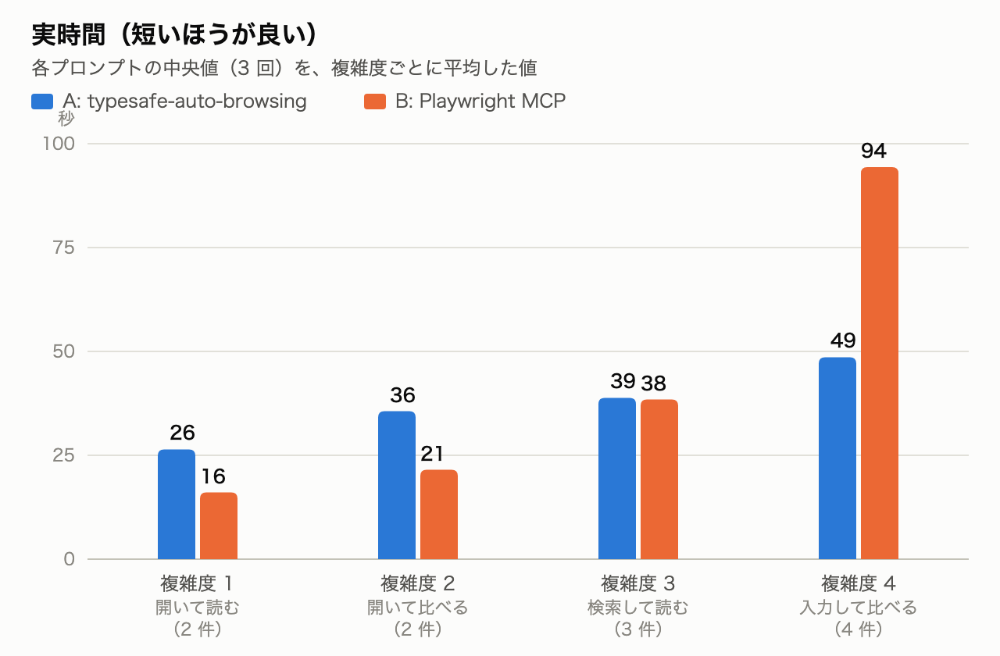
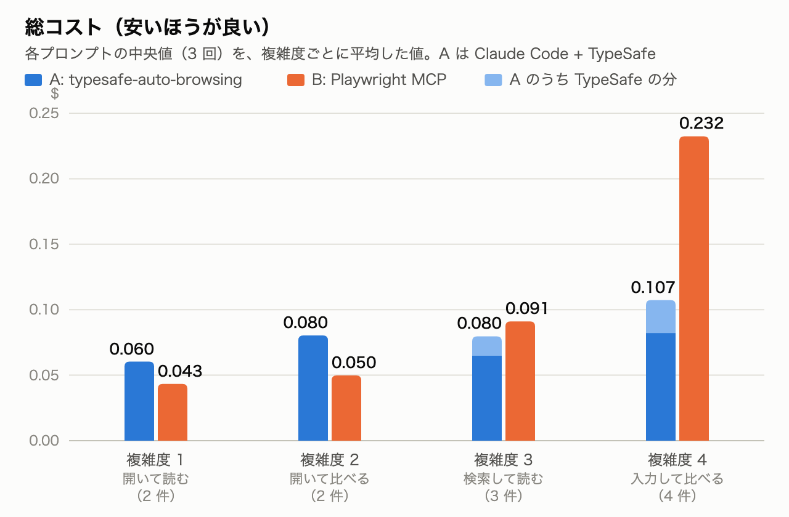
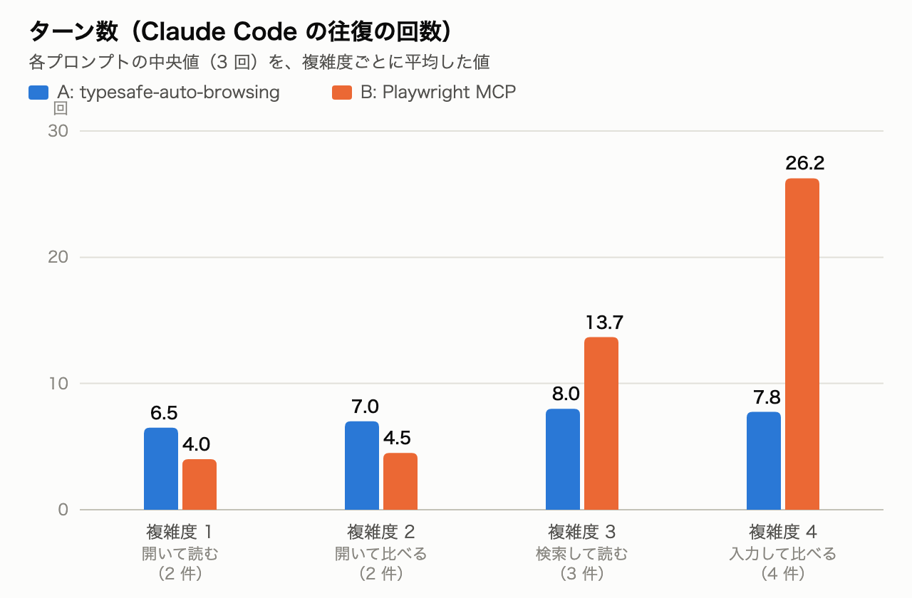
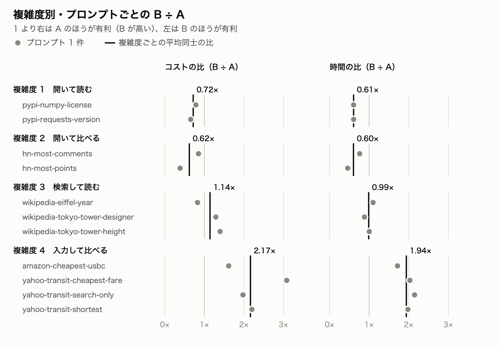

# 複雑度別の速度とコスト: Claude Code + typesafe-auto-browsing（A）と Claude Code + Playwright MCP（B）

`prompts/` の 11 個の目的を、操作の種類で複雑度 1〜4 に分け、[cost-comparison-claude-code.md](cost-comparison-claude-code.md) の計測（2026-09-20、`claude -p`、haiku、headed、各 3 回）を、複雑度ごとにまとめ直した記録です。

- **A: Claude Code + typesafe-auto-browsing**（スキルを使い、CLI を Bash で呼ぶ。ブラウザの操作は TypeSafe が決める）
- **B: Claude Code + Playwright MCP**（Claude Code が Playwright のツールを直接呼ぶ）

値は、プロンプトごとに 3 回の中央値を出し、それを複雑度ごとに平均したものです。A の総コストは、Claude Code の `total_cost_usd` に、TypeSafe の `usage.cost_usd` を足した値です。

## 複雑度とプロンプト

複雑度は、目的を達成するために必要な操作の種類で分けました。**分類は、計測のあとに付けたものです**（計測の前に決めたものではありません）。

| 複雑度 | 内容 | プロンプト数 |
|---|---|---|
| 1 開いて読む | URL を開くだけ。ページから 1 つの事実を読む | 2 |
| 2 開いて比べる | URL を開くだけ。ページに並ぶ多数の項目を比べて、1 つを選ぶ | 2 |
| 3 検索して読む | 検索語を 1 つ入力して記事を開き、事実を読む | 3 |
| 4 入力して比べる | 2 つ以上の入力（出発地と到着地、検索語と並べ替え）をして、結果を比べる。`yahoo-transit-search-only` だけは、比べずに検索まで | 4 |

各複雑度のプロンプト（`prompts/<名前>.txt` の目的文。計測では、先頭に、A は「typesafe-auto-browsing をつかって、」、B は「playwright-mcp をつかって、」を付けました）:

**複雑度 1 開いて読む**

- `pypi-numpy-license`: https://pypi.org/project/numpy/ を開いて、ライセンスを教えて
- `pypi-requests-version`: https://pypi.org/project/requests/ を開いて、最新バージョンを教えて

**複雑度 2 開いて比べる**

- `hn-most-comments`: https://news.ycombinator.com/ で一番コメントが多い記事のタイトルを教えて
- `hn-most-points`: https://news.ycombinator.com/ で一番ポイントが多い記事のタイトルを教えて

**複雑度 3 検索して読む**

- `wikipedia-eiffel-year`: https://ja.wikipedia.org/ で エッフェル塔 を検索して、完成した年を教えて
- `wikipedia-tokyo-tower-designer`: https://ja.wikipedia.org/ で 東京タワー を検索し、記事の設計者を教えて
- `wikipedia-tokyo-tower-height`: https://ja.wikipedia.org/ で 東京タワー を検索して、高さを教えて

**複雑度 4 入力して比べる**

- `amazon-cheapest-usbc`: https://www.amazon.co.jp/ で一番やすいusb-cケーブルをさがして
- `yahoo-transit-cheapest-fare`: https://transit.yahoo.co.jp/ で東京から大阪までを検索して、一番料金が安い経路の料金を教えて
- `yahoo-transit-search-only`: https://transit.yahoo.co.jp/ で横浜から青森までを検索して
- `yahoo-transit-shortest`: https://transit.yahoo.co.jp/ で横浜から青森までを検索して、一番所要時間が短い経路の所要時間を教えて

## 結果

| 複雑度 | 件数 | 時間 A / B（秒） | B÷A | 総コスト A / B（$） | B÷A | ターン A / B |
|---|---|---|---|---|---|---|
| 1 開いて読む | 2 | 26.4 / 16.1 | 0.61 | 0.060 / 0.043 | 0.72 | 6.5 / 4.0 |
| 2 開いて比べる | 2 | 35.6 / 21.5 | 0.60 | 0.080 / 0.050 | 0.62 | 7.0 / 4.5 |
| 3 検索して読む | 3 | 38.9 / 38.4 | 0.99 | 0.080 / 0.091 | 1.14 | 8.0 / 13.7 |
| 4 入力して比べる | 4 | 48.6 / 94.4 | 1.94 | 0.107 / 0.232 | 2.17 | 7.8 / 26.2 |

- B÷A は、1 より大きいと A が有利（B のほうが遅い、高い）、1 より小さいと B が有利です。
- ターンは、Claude Code の往復の回数です（A は、スキルを読む、前提を確認する、CLI を実行する、スナップショットを読む、という手順を含みます）。

## 複雑度ごとの分析

### 複雑度 1 開いて読む: B が速く、安い

| プロンプト | 時間 A / B（秒） | 総コスト A / B（$） | B÷A（コスト） | ターン A / B |
|---|---|---|---|---|
| pypi-numpy-license | 27.6 / 16.7 | 0.059 / 0.046 | 0.79 | 6 / 4 |
| pypi-requests-version | 25.3 / 15.4 | 0.062 / 0.040 | 0.65 | 7 / 4 |

- **B のほうが、時間で約 4 割短く（16 秒対 26 秒）、コストで約 3 割安い**（$0.043 対 $0.060）。B は、4 ターンで終わります。
- A の TypeSafe の分は $0.0006（コストの 1%）です。A のコストのほぼすべてが Claude Code の分で、**約 $0.06、25 秒前後は、目的が単純でも下がりません**。スキルを読み、Bash で前提を確認し、CLI を実行し、スナップショットを Read する、という固定の手順があるためです。
- 答えは、どの回も同じでした（requests の最新版、numpy のライセンス）。

### 複雑度 2 開いて比べる: B が速く、安い（差は目的による）

| プロンプト | 時間 A / B（秒） | 総コスト A / B（$） | B÷A（コスト） | ターン A / B |
|---|---|---|---|---|
| hn-most-comments | 34.2 / 26.0 | 0.080 / 0.068 | 0.85 | 7 / 5 |
| hn-most-points | 37.0 / 17.0 | 0.081 / 0.031 | 0.39 | 7 / 4 |

- B のほうが、時間で約 4 割短く（22 秒対 36 秒）、コストで約 4 割安い（$0.050 対 $0.080）。
- **目的で差が違います。** `hn-most-points` は、B の時間が A の 0.46 倍、コストが 0.39 倍と、差が大きい。`hn-most-comments` は、0.76 倍と 0.85 倍で、差が小さい。B のターンが 5 のときは差が小さく、4 のときに大きくなっています。
- A の TypeSafe の分は $0.0008（コストの 1%）で、ここでも A の費用は、Claude Code の固定分が中心です。
- 答えは、どの回も同じ記事でした。コメント数（872 / 875）とポイント数（1674 / 1676）は、実行時刻で変わります。

### 複雑度 3 検索して読む: 時間は並び、コストは一定しない

| プロンプト | 時間 A / B（秒） | 総コスト A / B（$） | B÷A（コスト） | ターン A / B |
|---|---|---|---|---|
| wikipedia-eiffel-year | 34.3 / 37.7 | 0.093 / 0.077 | 0.83 | 7 / 12 |
| wikipedia-tokyo-tower-designer | 41.5 / 36.6 | 0.074 / 0.095 | 1.29 | 9 / 14 |
| wikipedia-tokyo-tower-height | 40.8 / 40.9 | 0.072 / 0.100 | 1.40 | 8 / 15 |

- **時間は並びます**（A 38.9 秒、B 38.4 秒）。コストは、平均で B が 14% 高い（$0.091 対 $0.080）ものの、**プロンプトごとに 1 をまたぎます**（`wikipedia-eiffel-year` は B が 17% 安く、`wikipedia-tokyo-tower-height` は B が 40% 高い）。
- B のターンが、初めて A の手順（約 8）を大きく超えます（13.7）。A の TypeSafe の分が、初めて目に見える大きさになります（$0.008〜0.016、平均で $0.013、コストの 16%）。
- **ここが、A と B の損益分岐です。** 検索と記事の読み取りが加わると、B の往復が増え、A の固定の手順と釣り合う、と考えられます。
- 答えは、6 回すべて同じでした（東京タワー 333 m、設計者、エッフェル塔 1889 年）。

### 複雑度 4 入力して比べる: A が速く、安い

| プロンプト | 時間 A / B（秒） | 総コスト A / B（$） | B÷A（コスト） | ターン A / B |
|---|---|---|---|---|
| amazon-cheapest-usbc | 63.9 / 109.6 | 0.135 / 0.219 | 1.62 | 10 / 25 |
| yahoo-transit-cheapest-fare | 45.7 / 92.9 | 0.097 / 0.298 | 3.08 | 7 / 31 |
| yahoo-transit-search-only | 41.2 / 88.5 | 0.095 / 0.187 | 1.98 | 7 / 23 |
| yahoo-transit-shortest | 43.7 / 86.5 | 0.103 / 0.226 | 2.20 | 7 / 26 |

- **A のほうが、時間で約 2 倍速く（49 秒対 94 秒）、コストで約 2.2 倍安い**（$0.107 対 $0.232）。B は 26 ターン、A は 8 ターンで、A のターン数は、複雑度 1 のころからほとんど変わっていません。
- プロンプトごとの差は大きく、B÷A（コスト）は 1.62〜3.08 です。`yahoo-transit-cheapest-fare` は、B が 31 ターンかかり、3.08 倍になりました。
- A の TypeSafe の分は $0.023（コストの 22%）です。`amazon-cheapest-usbc` は $0.045 で、TypeSafe の分が最も大きい。
- **答えの正しさに差がありました**（[cost-comparison-claude-code.md](cost-comparison-claude-code.md) の「答えの確認」）。
  - Amazon は、A が 3 回とも ¥29 の商品を返し、B は ¥551、¥551、¥749 の商品を返しました（B は ¥29 を見つけられていません）。
  - `yahoo-transit-shortest` は、B の 1 回だけが「20 時間 41 分」と答えました（ほかの 5 回は 3 時間 25 分）。
  - `yahoo-transit-cheapest-fare` は、A も B も、回によって答えが分かれました（4,553 円、8,980 円、9,020 円）。

## 全体の分析

- **損益分岐は、複雑度 2 と 3 の間にあります。** 複雑度 1〜2 は B が速く、安い。複雑度 3 は並び、複雑度 4 は A が速く、安い。
- **B は、複雑度に応じて急に増えます。** 複雑度 1 から 4 で、時間が 5.9 倍（16 → 94 秒）、コストが 5.4 倍（$0.043 → 0.232）、ターンが 6.6 倍（4 → 26）になります。画面を操作するたびに往復が増えるためと考えられます。
- **A は、緩やかにしか増えません。** 時間が 1.8 倍（26 → 49 秒）、コストが 1.8 倍（$0.060 → 0.107）で、ターンは 6.5 → 7.8 とほぼ一定です。ブラウザの操作を TypeSafe に任せ、Claude Code 側の手順が変わらないためと考えられます。
- **A のコストの中身が、複雑度で変わります。** Claude Code の分は $0.060、0.080、0.067、0.084 と、ほぼ一定です。TypeSafe の分は $0.0006、0.0008、0.013、0.023 と増え、割合は 1%、1%、16%、22% です。複雑度が上がる分の費用は、単価の安い TypeSafe が負担しています。
- **A には、固定費があります。** どんなに単純な目的でも、約 $0.06、25 秒かかります。これが、複雑度 1〜2 で A が割高になる理由です。
- **使い分けの目安（大まかな指針）:**
  - ページを開いて読む、比べるだけなら、B が向きます。
  - 検索や入力が加わり、B が 13 ターン前後（A の手順の約 1.7 倍）を超えるあたりから、A が有利になります。

## 限界

- **分類は、計測のあとに付けました。** 各複雑度は 2〜4 件で、複雑度 3 と 4 のプロンプトごとの差も大きく、個々の結論は、目的に依存します。
- **各 3 回の中央値です。** 回ごとのばらつきは大きく、Amazon のコストは、A が $0.13〜0.22、B が $0.19〜0.22 と、回によって違いました。
- **答えの正しさは、自動では確かめていません。** 複雑度 4 では、A と B で答えが違う回がありました。
- **モデルは haiku だけ、実行は 1 日（約 50 分）だけです。** サイトの混み具合や、Claude Code のキャッシュの状態で、結果は変わります。
- そのほかの条件（コマンド、失敗の扱い、記録の場所）は、[cost-comparison-claude-code.md](cost-comparison-claude-code.md) にあります。
