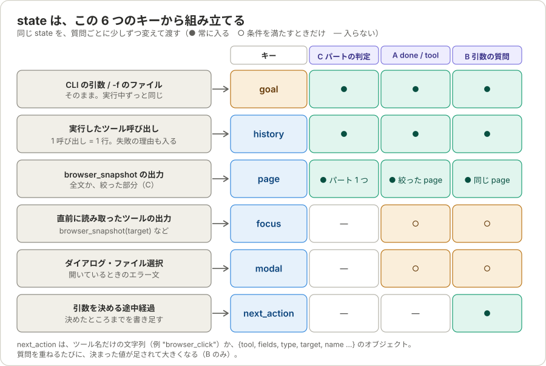
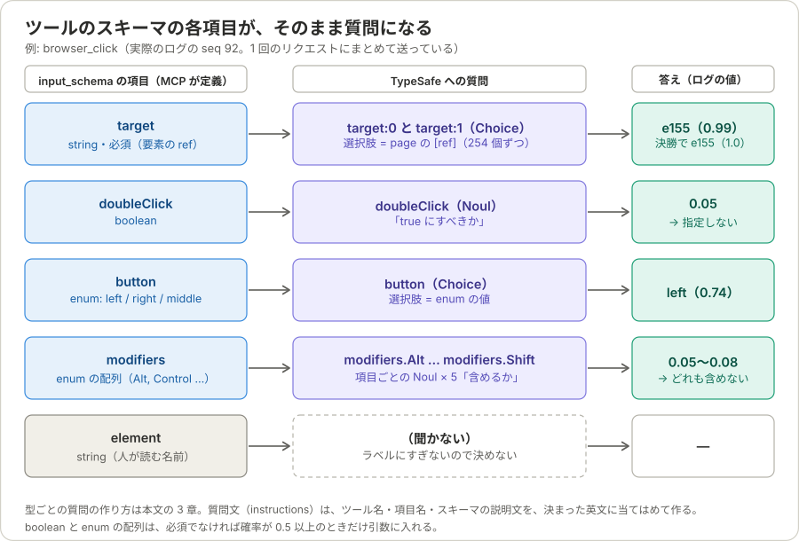
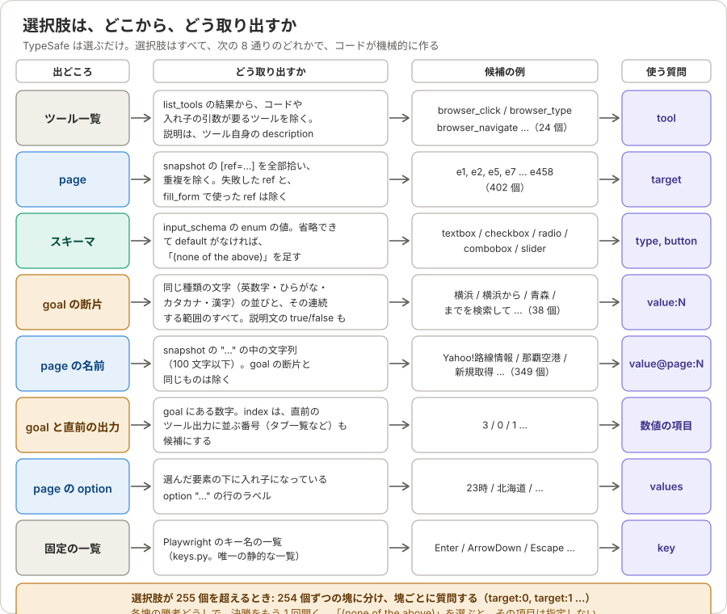
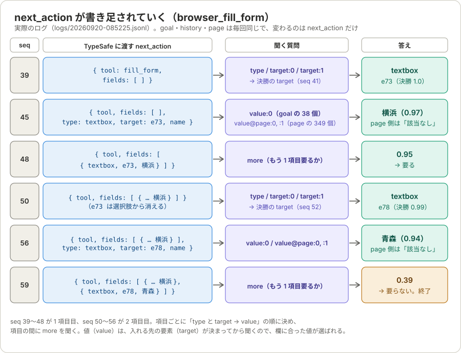
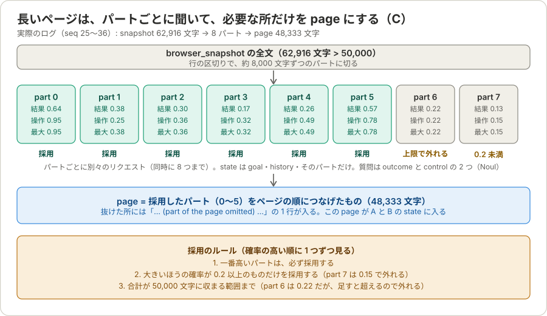

# TypeSafe への state と question は、何からどう組み立てるか

このプログラムでは、TypeSafe（Jev）に「選ばせる」ことだけが仕事です。TypeSafe は文字列を生成せず、コードが用意した**選択肢の中から選ぶ**か、**はい／いいえの確率を答える**だけです。

そのため、次の 3 つを正しく組み立てることが、このプログラムの中心です。

| 名前 | 意味 | 何で作るか |
|---|---|---|
| **state** | TypeSafe が読む材料（今の状況） | 目的文、実行した操作の記録、ページ、途中経過 |
| **question** | TypeSafe に答えさせる問い | 固定の問い、またはツールのスキーマから作る問い |
| **候補（選択肢）** | question の中で、TypeSafe が選ぶ選択肢 | 目的文・ページ・スキーマ・ツール一覧から、機械的に取り出す |

この文書では、実行の全体の流れのあと、state、question、候補の順に、どの情報から、どう組み立てるかを説明します。

- 例の数値と JSON は、実際の実行記録 `logs/20260920-085225.jsonl`（Yahoo 乗換案内で「横浜から青森までを検索」）から取ったものです。`logs/` は git 管理外なので、手元で実行すると同じ形の記録ができます。確かめ方は「7. 記録で確かめる」にあります。
- 全体像、1 ステップの分岐、終了と失敗の条件、費用、限界は [architecture.md](architecture.md)、Amazon の例の 1 ステップずつの追跡は [walkthrough-amazon-usbc.md](walkthrough-amazon-usbc.md) にあります。

---

## 1. 全体の流れ


目的（goal）を受け取ると、ブラウザを操作するループに入ります。1 周（1 ステップ）は、次の 5 つの処理です。

| | 処理 | TypeSafe に聞くこと |
|---|---|---|
| ① | `browser_snapshot` でページの全文を取る。直前の操作がページを変えたなら、前回と同じ形になるまで取り直す | なし |
| ② | **page を作る（C）**。短いページはそのまま、長いページは約 8KB のパートに分けて、必要なパートだけを残す | パートごとに `outcome` と `control`（Noul） |
| ③ | **判断（A）**。目的は達成済みか、次に呼ぶツールは何か | `done`（Noul）と `tool`（Choice）を 1 回のリクエストで |
| ④ | **引数（B）**。選んだツールの引数を決める | ツールのスキーマから作った質問（Choice / Noul）を、何回かに分けて |
| ⑤ | ツールを MCP で呼び、`history` に 1 行足す | なし |

- `done` が 0.8 以上なら成功で終わります。失敗で終わるのは、同じページで同じ呼び出しが 3 回になった、最大ステップ数（20）に達した、使えるツールが 3 ステップ続けてなかった、ブラウザを閉じた、のいずれかです。
- ③ で選ばれたツールが、今のページでは使えないと分かったとき（引数の候補がない）は、そのツールを除いて、`tool` を聞き直します（1 ステップの中で最大 3 回）。
- ① の取り直しは、1 秒間隔で最大 5 回です。比べるときは、`[ref=…]` と数字（カウントダウンなど）を除きます。ページを変える操作が、画面の更新の終わる前に戻ることがあるためです（例: Playwright MCP の `browser_select_option` は、操作のあとの待ちがなく、直後のスナップショットは一覧が空だった）。TypeSafe には聞かず、MCP を呼ぶだけです。
- 終わると、結果（`success`、`reason`、最後のページの URL とタイトル、最後のスナップショット全文のファイルのパス）を返します。

---

## 2. state の組み立て



state は 6 つのキーからなる辞書です。TypeSafe へのリクエストのたびに、コードが組み立て直します（`build_state`、[arguments.py](../src/typesafe_auto_browsing/arguments.py)）。

### 2.1 各キーの中身と出どころ

| キー | 出どころ | 中身 |
|---|---|---|
| `goal` | CLI の引数、または `-f` のファイル | 目的の文字列。加工せず、実行中ずっと同じ |
| `history` | ⑤ で実行したツール呼び出し | 文字列のリスト。1 呼び出し = 1 行 |
| `page` | ① の `browser_snapshot` の出力を、② で絞ったもの | Playwright MCP の出力そのまま（長ければ一部） |
| `focus` | 直前に呼んだ読み取り専用ツールの出力 | あるときだけ。最大 8,000 文字 |
| `modal` | ダイアログやファイル選択が開いたときのエラー文 | あるときだけ |
| `next_action` | ④ で決めている途中の引数 | B の質問にだけ入る |

**`goal`**

```
https://transit.yahoo.co.jp/ で横浜から青森までを検索して
```

**`history`**: 実行した呼び出しが、`ツール名 引数の JSON` の形で、古い順に並びます。

```json
[
  "browser_navigate {\"url\": \"https://transit.yahoo.co.jp/\"}",
  "browser_fill_form {\"fields\": [{\"type\": \"textbox\", \"target\": \"e73\", \"name\": \"textbox\", \"value\": \"横浜\"}, …]}",
  "browser_click {\"button\": \"left\", \"target\": \"e155\"}"
]
```

- まだ何もしていないときは `["(nothing done yet)"]` です。
- 引数は、質問の答えとして確定した値です（`button` の `left` など）。
- 失敗した呼び出しは `… -> FAILED: 理由`（エラーの先頭 4 行、最大 400 文字）、`--confirm` で拒否されたものは `… -> DECLINED by the user`、使えるツールがなかったときは `(no tool could be used: …)` として残ります。TypeSafe は次のステップで、これを見て別の手を選びます。
- ツールの出力（ページの内容など）は入りません。「何をしたか」だけを持ちます。

**`page`**: `browser_snapshot` の出力（アクセシビリティツリーの YAML）です。

````
### Page
- Page URL: https://transit.yahoo.co.jp/
- Page Title: 乗換案内、時刻表、運行情報 - Yahoo!路線情報
### Snapshot
```yaml
- generic [ref=e1]:
  …
      - textbox "ウェブ検索" [ref=e16]
      - button "検索" [ref=e17] [cursor=pointer]
```
````

- 要素に付いた `[ref=e16]` が、`target` の候補の元になります。
- 50,000 文字以下なら全文、それより長いときは、C で選んだパートをつなげたものです（「6. 長いページの絞り込み」）。
- TypeSafe が長すぎると断ったとき（`max_tokens_exceeded`）は、`page` を半分に切り詰めて再送します（最小 2,000 文字）。入った長さは覚えていて、次のステップでは 2 倍ずつ（50,000 文字まで）戻します。
- 1 ステップの中の質問（A、B）は、すべて同じ `page` を使います。だから、候補の ref は、C が残したパートの中にあるものだけです。

**`focus`**: 直前のステップで、読み取り専用ツール（例: 要素を指定した `browser_snapshot`、`browser_tabs` の一覧）を呼んだときの出力です。ページ全体の `browser_snapshot` は入りません（毎ステップ取り直すため）。ページを変える操作をすると消えます。

**`modal`**: ダイアログやファイル選択が開いていると、`browser_snapshot` はエラーを返し、その文に `### Modal state` が出ます。この文を入れ、選べるツールを、そのモーダルを扱えるもの（例: `browser_handle_dialog`）だけに絞ります。

**`next_action`**: 引数を決めている途中の状態です。ツール名だけのときは文字列、項目が増えるとオブジェクトです。

```json
"browser_click"
```
```json
{"tool": "browser_fill_form",
 "fields": [{"type": "textbox", "target": "e73", "name": "textbox", "value": "横浜"}]}
```

質問を重ねるたびに、決まった値が足されて大きくなります。目的は、あとの質問が、前の答えを知った状態で選べるようにすることです（入れる文字列は、入れる先の入力欄によって変わるため）。詳しくは「5. 具体例」にあります。

### 2.2 質問の段階ごとの state

| 質問 | `goal` | `history` | `page` | `focus` / `modal` | `next_action` |
|---|---|---|---|---|---|
| C: パートの判定（`outcome`、`control`） | ○ | ○ | そのパート 1 つ（約 8KB） | なし | なし |
| A: `done` と `tool` | ○ | ○ | 絞った page | あれば | なし |
| B: 引数の質問 | ○ | ○ | A と同じ page | あれば | ○（途中経過） |

- C の質問には、`page` に**パート 1 つだけ**を入れます（`focus` などは入れません）。
- 最後の実行結果を返す段階では、TypeSafe には何も聞きません。

---

## 3. question の組み立て

TypeSafe に渡す `questions` は、「名前 → 質問」の辞書です。質問は 2 種類あります。

| 種類 | 何を聞くか | 返ってくるもの |
|---|---|---|
| **Choice** | 選択肢の中から 1 つ | 選ばれたもの、確信度、全選択肢の確率 |
| **Noul** | はい／いいえ | 「はい」の確率 |

質問は、次の 2 通りで作られます。

### 3.1 固定の質問

コードに直接書かれている質問です。

| 質問 | 種類 | いつ | 中身 |
|---|---|---|---|
| `outcome` | Noul | C（パートごと） | 「このパートに、目的の結果、またはそこまでの進み具合があるか」 |
| `control` | Noul | C（パートごと） | 「このパートに、次に操作する入力欄やボタンやリンクがあるか」 |
| `done` | Noul | A（毎ステップ） | 「目的は達成済みか。ページが目的の結果を示しているか」 |
| `tool` | Choice | A（毎ステップ） | 「次に呼ぶブラウザのツールは何か」。選択肢は、使えるツール名 |
| `more` | Noul | B（配列の引数） | 「これまでの項目のあと、もう 1 項目要るか」 |

`tool` の選択肢は `list_tools` の結果から作ります。名前が選択肢で、説明は**ツール自身の `description`** をそのまま使います。

```json
"tool": {
  "type": "choice",
  "instructions": "Which browser tool should be called next to make progress toward `goal`, given `history` and the current `page`?",
  "criteria": {
    "browser_close": "Close the page",
    "browser_resize": "Resize the browser window",
    "browser_console_messages": "Returns all console messages",
    "…": "…（24 個）"
  }
}
```

### 3.2 スキーマから作る質問（B）



ツールの引数の質問は、コードに書かれていません。そのツールの `input_schema`（Playwright MCP が定義）の各項目を、**型に応じて**質問にします（`_decide_object`）。だから、ツールが増えても、コードを足す必要がありません。

| スキーマの項目 | 作る質問 | 選択肢の出どころ |
|---|---|---|
| `target` / `ref` / `…Target` | Choice `target:N` | ページの `[ref=…]` |
| `enum` | Choice（項目名そのまま） | enum の値 |
| `boolean` | Noul | なし |
| `enum` の配列（例 `modifiers`） | 項目ごとの Noul（`modifiers.Alt` など） | なし |
| 文字列・数値 | Choice を 2 つ（`value:N` と `value@page:N`） | 目的文の断片と、ページの名前 |
| 文字列の配列（例 `values`） | Choice | 選んだ要素の下の `option`、なければ文字列の候補 |
| オブジェクトの配列（例 `fields`） | 1 項目ずつ、上の規則をくり返し、間に `more` | — |
| JavaScript のコードを要する文字列、入れ子の構造体 | ツールごと、選択肢から外す | — |
| `element`、`filename`、`depth` | 聞かない | — |

- `element` は人が読むラベル、`filename` は出力を応答の外に出してしまうもの、`depth` はスナップショットの木を切ってしまうものなので、TypeSafe には決めさせません。
- 必須でない `enum` は、`default` がなければ、選択肢の最後に「(none of the above)」（指定しない）を足します。

### 3.3 質問文（instructions）の作り方

質問文は、ツール名・項目名・スキーマの `description` を、決まった英文に当てはめて作ります。

```
ref       Which element of the current `page`, identified by its [ref], should the next
          `{ツール}` call use as `{項目}`, given `goal` and what `history` already did? {description}

enum      Which value of `{項目}` should the next `{ツール}` call use? {description}

boolean   For the next `{ツール}` call, `{項目}` should be true. ({description})

enum の   For the next `{ツール}` call, `{項目}` should include `{値}`. ({description})
配列

文字列・  What should `{項目}` be for the next `{ツール}` call? {description} The candidates are
数値      parts of `goal` or texts of `page`, … Pick the last option when no candidate is the value.

more      After the `{項目}` chosen so far, one more entry should be added to the same
          `{ツール}` call to make progress toward `goal`.
```

質問文の中に、`goal` や `history` の**中身は書きません**。`goal`、`history`、`page`、`next_action` という名前で参照するだけで、実際の値は state から TypeSafe が読みます。

### 3.4 聞く順序と、答えの採用ルール

1 つのツールの引数は、次の順に、段階を分けて聞きます。

1. **選択・boolean・要素**: enum、boolean、enum の配列、`target` を、1 つのリクエストで。`next_action` はツール名（配列の項目の中では、決まった値まで）。
2. **値**: 文字列・数値を、`target` が決まったあとに。`next_action` に `target` などを足して聞く。
3. **文字列の配列**: `values` など。
4. **オブジェクトの配列**: 1 項目ずつ 1〜3 をくり返し、間に `more` を聞く（最大 10 項目）。

答えは、次のルールで引数に採用します。

- **Choice**: 選ばれたものを、そのまま写す。「(none of the above)」なら、その項目は指定しない。
- **文字列・数値の Choice**: 確信度が 0.5 未満なら採用しない（ref は確信度を問わない）。目的文の候補（`value:N`）を先に見て、決まらないときだけページの名前（`value@page:N`）を使う。
- **Noul**: 必須の boolean は、確率が 0.5 以上なら true、未満なら false。必須でない boolean と、enum の配列の項目は、0.5 以上のときだけ引数に入れる（入れないときは指定しない）。
- **必須の引数が決まらない**: そのツールは今回は使えない、として `tool` を聞き直す。
- **同時に指定できない項目の組**（スキーマの説明が「どちらか一方だけ」と言うもの）は、順序が先のほうだけを残す。

---

## 4. 候補（選択肢）の取り出し方



選択肢は、TypeSafe が作るものではなく、**コードが機械的に取り出したもの**です。取り出し方は 8 通りあります。

### 4.1 ツール一覧（`tool`）

`list_tools` の結果のうち、スキーマだけでは決められないツール（JavaScript のコードが必須の引数、入れ子の構造体が必須の引数）を、起動時に除きます（`unusable_reason`）。除いたものは、起動時に理由を表示します（例: `browser_evaluate`: `function` is code）。残ったものが `tool` の選択肢で、説明はツールの `description` です。

### 4.2 ページの ref（`target`）

`page` の中の `[ref=eNN]` を、正規表現ですべて拾い、重複を除きます。

- **除くもの**: そのツールが今のページで失敗した ref（ページが変わるまで）。`browser_fill_form` の 2 項目目では、1 項目目で使った ref も除きます。
- **どのページから拾うか**: C が残した `page` の範囲からだけです。残らなかったパートにある要素は、選べません。

### 4.3 スキーマの enum（`type`、`button` など）

`input_schema` の `enum` の値です。`anyOf` の中にある enum も拾います。

### 4.4 目的文の断片（文字列の `value:N`）

`goal_candidates` が、目的文から、値になりうる部分を**すべて**取り出します。

1. 目的文を、同じ種類の文字が続く範囲（**語**）に切る。種類は、英数字・記号（URL など）、ひらがな、カタカナ、漢字、その他。空白は語の区切り。
2. 隣り合う語の、あらゆる連続範囲を作る（空白を含んでもよい）。
3. 空白で区切った各部分も足す。

例: 「横浜から青森までを検索して」は、6 つの語（`横浜` / `から` / `青森` / `までを` / `検索` / `して`）に切れ、21 個の候補（`横浜`、`横浜から`、`横浜から青森`、…、`から`、`から青森`、…）になります。

- 語が n 個なら、候補は n(n+1)/2 個です。実際の目的文（URL 付き、8 つの語）では 36 個で、下の true / false と合わせて 38 個でした（選択肢の数は、これに「(none of the above)」を足した 39 です）。
- 説明文に `` `true` `` や `` `false` `` があるとき（チェックボックスの値）は、それも足します。
- **コードは、目的文にない文字列を作りません。**「横浜」や「青森」は、この一覧から選ばれたものです。

### 4.5 ページの名前（文字列の `value@page:N`）

`page_names` が、スナップショットの各行にある `"…"` の中の文字列（リンク、ボタン、見出しなどの名前）を取り出します。

- 100 文字以下のもの、重複は除く。
- 目的文の断片と同じものは除く（同じ文字列を 2 つの質問で聞かないため）。
- 例: `Yahoo!路線情報`、`那覇空港`、`新規取得`。

### 4.6 数字

- 目的文に出てくる数字（`\d+(\.\d+)?`）。
- 項目名が `index` のときは、直前のツールの出力やページの先頭にある番号の一覧（タブの `- 0: (current) …`、リクエストの `1. [GET] …`）も足します。

### 4.7 `option` のラベル（`values`）

`browser_select_option` の `values` のように、文字列の配列を決めるときは、先に決めた要素の下に**入れ子になっている** `option "…"` の行のラベルを、選択肢にします（`options_under`）。そのような `option` がなければ、目的文の断片とページの名前を選択肢にします。

### 4.8 固定の一覧（`key`）

`browser_press_key` の `key` は、Playwright のキー名の一覧（[keys.py](../src/typesafe_auto_browsing/keys.py)）も選択肢にします。プログラムの中で、唯一の静的な一覧です。

### 4.9 選択肢が多いとき

1 つの Choice に入れられる選択肢は 255 個までです。それを超えるときは、次のようにします（`ask_picks`）。

1. 254 個ずつの塊に分け、塊ごとに別の質問にする（`target:0`、`target:1`、…）。同じリクエストで一度に聞く。
2. 各塊の勝者が複数あれば、その勝者だけを選択肢にして、`target`（塊の番号なし）を**もう 1 回**聞く（決勝）。
3. 「(none of the above)」を選べる質問（文字列・数値・任意の enum）は、各塊にそれを足す。

---

## 5. 具体例

### 5.1 `browser_fill_form`: `next_action` が育つ



横浜から青森までを検索するために、2 つの入力欄を埋めるときの、実際のログです。`goal`、`history`、`page` は毎回同じで、変わるのは `next_action` だけです。

1. **1 項目目の `type` と `target`（seq 39）**: `next_action` は `{tool, fields: []}` です。`type` は 5 つの選択肢から `textbox`。`target` は 402 個の ref を 254 個と 148 個に分けて聞き、勝者の `e73` と `e422` で決勝（seq 41）にして、`e73` に決まります。
2. **1 項目目の `value`（seq 45）**: `type` と `target`（`e73`）が決まったので、`next_action` に足して聞きます。目的文の断片 38 個（`value:0`）とページの名前 349 個（`value@page:0`、`:1`。255 個までで分けるため 2 つの質問）を並べて聞き、`横浜`（0.97）が選ばれます。ページの名前は、どれも「該当なし」でした。
3. **`more`（seq 48）**: 1 項目が入った `fields` を見せて、「もう 1 項目要るか」を聞きます。0.95 で「要る」です。
4. **2 項目目（seq 50〜56）**: 同じ手順です。ただし、`e73` は ref の選択肢から消えています（1 項目目で使ったため）。`e78`、`青森` が選ばれます。
5. **`more`（seq 59）**: `fields` が 2 項目になった状態で聞くと、0.39 で「要らない」となり、この呼び出しが完成します。

決まったものは、こう組み立てられます（MCP に渡す引数）。

```json
{"fields": [
  {"type": "textbox", "target": "e73", "name": "textbox", "value": "横浜"},
  {"type": "textbox", "target": "e78", "name": "textbox", "value": "青森"}
]}
```

`name`（人が読む名前）は、TypeSafe に聞かず、選ばれた要素の名前をコードがページから写したものです。

### 5.2 `browser_click`: 質問を一度にまとめる

`fill_form` と違い、`browser_click` は配列の引数がなく、質問はほぼ 1 回のリクエストにまとまります（seq 92）。

```json
{
  "state": {
    "goal": "https://transit.yahoo.co.jp/ で横浜から青森までを検索して",
    "history": ["browser_navigate {…}", "browser_fill_form {…}"],
    "page": "（絞った約 49,000 文字）",
    "next_action": "browser_click"
  },
  "questions": {
    "doubleClick": {"type": "noul", "instructions": "For the next `browser_click` call, `doubleClick` should be true. (…)"},
    "button": {"type": "choice", "criteria": {"left": null, "right": null, "middle": null}},
    "modifiers.Alt": {"type": "noul"},
    "target:0": {"type": "choice", "criteria": {"e1": null, "…": null, "e285": null}},
    "target:1": {"type": "choice", "criteria": {"e286": null, "…": null, "e458": null}}
  }
}
```

`target` は 148 個の塊にも勝者がいるので、決勝（seq 94）でもう 1 回聞きます。答えは、`target` が `e155`（0.99）、`button` が `left`（0.74）で、`doubleClick` と `modifiers.*` は 0.05〜0.08 と低いので、引数に入りません。結果は `browser_click {"button": "left", "target": "e155"}` で、これが `history` に足されます。

---

## 6. 長いページの絞り込み（C）



TypeSafe が一度に読める量には限りがあります（約 32k トークン）。ページが 50,000 文字を超えるときは、`page` に全文を入れず、次のようにして、必要な部分だけを残します（`view_page`、[page_view.py](../src/typesafe_auto_browsing/page_view.py)）。

1. スナップショットを、行の区切りで、約 8,000 文字のパートに切る。
2. パートごとに、別のリクエスト（同時に 8 つまで）で、`outcome` と `control` を聞く。state には、`goal`、`history`、そのパートだけが入る。
3. パートごとの確率は、2 つのうち大きいほう。
4. 確率の高い順に、次の条件で採用する。
   - 一番高いパートは、必ず採用する。
   - 確率が 0.2 以上のものだけを採用する。
   - 合計が 50,000 文字に収まる範囲まで。
5. 採用したパートを、ページの順につなげる。抜けた所には `... (part of the page omitted) ...` の 1 行を入れる。

全文は、実行記録の隣のファイルに残るので、TypeSafe に見せなかった部分も、あとから調べられます。

---

## 7. 記録で確かめる

TypeSafe に送った state と questions は、すべて `logs/<日時>.jsonl` に、省略なしで記録されます（`typesafe_request` と `typesafe_response`）。

各リクエストの、`history` の数、`page` の長さ、`next_action`、質問の名前の一覧:

```sh
jq -c 'select(.kind=="typesafe_request")
  | {seq, history: (.state.history|length), page: (.state.page|length), next_action: .state.next_action, questions: (.questions|keys)}' logs/<日時>.jsonl
```

あるリクエストの、質問の種類と、選択肢の数:

```sh
jq -c 'select(.kind=="typesafe_request" and .seq==50)
  | .questions | map_values({type, options: ((.criteria // {}) | length)})' logs/<日時>.jsonl
```

質問文の全文と、`tool` の選択肢:

```sh
jq -r 'select(.kind=="typesafe_request" and .seq==50) | .questions["target:0"].instructions' logs/<日時>.jsonl
jq -c 'select(.kind=="typesafe_request" and .seq==6) | .questions.tool.criteria' logs/<日時>.jsonl
```

TypeSafe の答え（確率つき）:

```sh
jq -c 'select(.kind=="typesafe_response") | {seq, answers: .response.answers}' logs/<日時>.jsonl
```

C のパートごとの確率:

```sh
jq -c 'select(.kind=="page_view")' logs/<日時>.jsonl
```

---

## 8. コードの場所

| 何 | どこ |
|---|---|
| state の組み立て | `build_state`（[arguments.py](../src/typesafe_auto_browsing/arguments.py)） |
| ループ、`history`、`focus`、`modal`、`done` と `tool` の質問 | `run_agent`、`_tool_question`、`GOAL_ACHIEVED`（[agent.py](../src/typesafe_auto_browsing/agent.py)） |
| 長いページの絞り込み（C） | `view_page`、`split_parts`（[page_view.py](../src/typesafe_auto_browsing/page_view.py)） |
| スキーマから質問を作る（B） | `decide`、`_decide_object`（[arguments.py](../src/typesafe_auto_browsing/arguments.py)） |
| 候補の取り出し | `goal_candidates`、`page_names`、`_refs`、`options_under`、`_enum`（[arguments.py](../src/typesafe_auto_browsing/arguments.py)） |
| 選択肢が多いときの分割と決勝 | `ask_picks`（[arguments.py](../src/typesafe_auto_browsing/arguments.py)） |
| 使えないツールの判定 | `unusable_reason`（[arguments.py](../src/typesafe_auto_browsing/arguments.py)） |
| キー名の一覧 | `KEYS`（[keys.py](../src/typesafe_auto_browsing/keys.py)） |

図（`images/*.svg`）は SVG の手書きです。数値は上の実行記録から取っています。挙動を変えたときは、図と表の数値を合わせて直してください。
