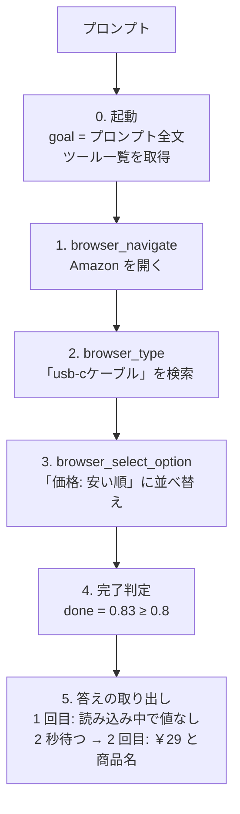

# 1 つのプロンプトを 1 ステップずつ追う（Amazon の最安 USB-C ケーブル）

```
https://www.amazon.co.jp/ で一番やすいusb-cケーブルをさがして
```

このプロンプト（[prompts/amazon-cheapest-usbc.txt](../prompts/amazon-cheapest-usbc.txt)）が、どう分解され、どのツール呼び出しになり、どう答えになったかを、実際の実行記録に沿って 1 つずつ書きます。全体像は [architecture.md](architecture.md) を見てください。

- 数値（確率、文字数、リクエスト数）は `logs/20260919-201719.jsonl`（2026-09-19 20:17 の実行）から取ったものです。ページの状態によって実行ごとに変わります。
- 関数名は `src/typesafe_auto_browsing/` のものです。
- この実行は約 16.6 秒、TypeSafe へのリクエストは 85 回、費用は約 $0.026 でした。結果は `goal achieved (p=0.83)` で成功です。
- 記録の `answers` は `items`（value と subject）の形です。現在のコードは順位つきの `candidates` を返すので、答えの形式はこの記録の時点と現在で異なります。

## 全体の流れ



毎ステップの基本形は同じです。

```
browser_snapshot → （長ければ view_page() で絞る）→ TypeSafe: 完了か? / 次のツールは?
                 → decide(): TypeSafe: 各引数は? → MCP でツールを実行
```

## TypeSafe への入力の読み方

以降の各ステップで「TypeSafe に聞く」と書いてあるものは、すべて次の 1 種類の呼び出しです（`usage.py` の `MeteredClient.system_one`）。

```python
response = await client.system_one(state, questions)
```

入力は `state` と `questions` の 2 つだけです。会話の履歴や、前回のリクエストの結果は渡されません。**リクエストは毎回独立**で、前の操作を伝えるのは `state.history` だけです。

### state: TypeSafe が読む材料

| キー | 中身 | この実行での例 |
|---|---|---|
| `goal` | プロンプト全文。書き換えず、すべてのリクエストに同じものを入れる | `"https://www.amazon.co.jp/ で一番やすいusb-cケーブルをさがして"` |
| `history` | これまでに実行したツール呼び出しを `ツール名 引数のJSON` の文字列で並べたリスト。最初は `["(nothing done yet)"]` | `["browser_navigate {\"url\": \"https://www.amazon.co.jp/\"}", "browser_type {…}"]` |
| `page` | 直前の `browser_snapshot` の結果（Playwright MCP が返した YAML）。窓に入らなければ `view_page()` が選んだ部分だけ。答えの取り出しでは空（`""`）のことも、8,000 文字ほどの 1 部分のこともある | `- Page URL: …` と `- combobox "並べ替え::" [ref=f2e255]: …` を含む YAML |
| `next_action` | 引数を決めるときだけ付く。「いま決めているツール」と、そこまでに決まった引数 | `"browser_type"` → `{"tool": "browser_type", "submit": true, "target": "e90"}` |

- ほかに、読み取り専用ツールの出力（`focus`）や、ダイアログの状態（`modal`）が加わることがありますが、この実行では出ていません。
- `page` はスナップショットをそのまま（省略や要約なしで）入れています。長いときだけ、部分ごとに切って必要な部分を選びます。

### questions: TypeSafe に答えさせる質問

`questions` は「名前 → 質問」の辞書です。質問には 2 種類あります。

| 種類 | 何が入るか | 返ってくるもの |
|---|---|---|
| **Noul**（はい／いいえの確率） | `instructions`（「〜である」という文）。`criteria` で `true` / `false` の意味を補うこともある | 0〜1 の確率（`0.83` など） |
| **Choice**（選択肢から 1 つ） | `instructions`（質問文）と `criteria`（`選択肢 → 説明`。説明のない選択肢は `null`） | 選ばれた選択肢、その確信度、**全選択肢の確率** |

- 質問文（`instructions`）は英語で書いてあり、`goal`、`history`、`page`、`next_action` を名前で指します（例: 「given `goal` and what `history` already did」）。
- Choice の選択肢は、質問ごとに次のものを入れます。

  | 質問 | 選択肢に入れるもの | 説明（値） |
  |---|---|---|
  | `tool` | ツール名 24 個 | そのツールの `description`（MCP のもの） |
  | `target` | ページ内の `[ref=…]`（`e2`、`f2e255` など） | なし |
  | `url`、`text`、`hint` | `goal_candidates` の 28 個 + `(none of the above)`（`text` は別にページの文字列も） | なし |
  | `values` | 選んだ要素の配下の `option` の文字列 | なし |
  | `outcome`、`control` | `part 0`〜`part 75` | その部分の短いラベル（操作要素と文字列の抜粋） |
  | `value`、`best`、`subject` | ページ上の文字列 | なし |

- 1 つの質問に入れられる選択肢は 255 個までです。超えるときは `target:0`、`target:1` のように塊に分け、各塊の勝者で決勝を行います。
- TypeSafe の入力窓は約 32k トークンです。入らなければ `ask_fitting_page()` がページを半分にして、入るまで再送します。
- 1 つのリクエストに、複数の質問を入れられます（例: `done` と `tool`、`submit` と `slowly` と `target`）。

### 返ってくるもの

```json
{"done": {"type": "noul", "noul": 0.01},
 "tool": {"type": "choice", "choice": "browser_navigate", "confidence": 1.0,
          "probabilities": {"browser_navigate": 1.0, "browser_click": 0.0, "…": 0.0}}}
```

code は、選ばれた選択肢の文字列をそのままコピーして引数にします。TypeSafe が新しい文字列を返すことはありません。

### この実行の 85 リクエストの内訳

| 質問の名前 | いつ | state に入れるもの | 何を聞くか | 選択肢 |
|---|---|---|---|---|
| `done` | 各ステップ | `goal` `history` `page` | 目的は達成済みか | Noul |
| `tool` | 各ステップ（`done` と同じリクエスト） | 同上 | 次に呼ぶツールは | ツール 24 個 |
| `outcome`、`control` | ページが 50,000 文字を超えるとき | `goal` `history`（`page` は入れない） | 成果／操作対象を含む部分は | 部分（76 個） |
| `url`、`text`、`values` など | ツール決定後 | `next_action` を加える | その引数の値は | goal の候補、ページの文字列、`option` |
| `target` | 要素を指す引数があるとき | `next_action` を加える | どの要素か | `[ref]`（最大 255 個ずつ） |
| `submit`、`slowly` など | boolean の引数 | `next_action` を加える | その引数は true か | Noul |
| `wanted` | 答えの取り出し | `goal` `history` | 報告すべき答えを求めるか | Noul |
| `compare`、`direction` | 同上 | 同上 | 最小／最大を比べるか、どちらか | Noul、Choice（`lowest` / `highest`） |
| `hint` | 同上 | 同上 | 何の量で比べるか | goal の候補 |
| `value` | 同上（ページの部分ごと） | `page` は 1 部分 | その部分で、比べる量の最小値は | ページの文字列 |
| `best` | 同上 | `goal` `history` | 各部分の勝者のうち最小は | 勝者 37 個 |
| `subject` | 同上 | `page` は値の前後 10,000 文字 | その値が属する商品名は | ページの文字列 |

以降のステップでは、それぞれの実際の入力を、ログから抜き出して載せます。長い選択肢は `…` で省略していて、全文は `logs/20260919-201719.jsonl` の `typesafe_request` にあります。

## 0. 起動: プロンプトが goal になる

1. CLI（`__init__.py` の `_read_goal`）が、プロンプトを **そのまま** `goal` にします。書き換えも解釈もしません。`-f` で渡したファイルなら、`#` で始まる行と空行だけを除いて連結します。
2. Playwright MCP を `npx @playwright/mcp` で起動し、`list_tools` で 25 個のツール（名前、`description`、`input_schema`）を受け取ります。
3. `unusable_reason()` が、スキーマだけで「選択式では引数を埋められない」ツールを除きます。この実行では `browser_evaluate` が、必須引数 `function` がコードなので除かれました。ほかの 24 個が `run_agent()` に渡されます。

## goal の分解: `goal_candidates(goal)`

TypeSafe は文字列を書けません。そこで、引数の値になりうる部分文字列を先に全部作り、TypeSafe に選ばせます。

1. 文字種（ASCII、ひらがな、カタカナ、漢字）が切り替わる位置で、空白を区切りとして、7 つに切ります。

   ```
   [https://www.amazon.co.jp/] [で] [一番] [やすい] [usb-c] [ケーブル] [をさがして]
   ```

2. 隣り合う断片の **全区間** を候補にします。7 個なら 7×8/2 = 28 個です。

   ```
   https://www.amazon.co.jp/ ／ https://www.amazon.co.jp/ で ／ … ／ で ／ で一番 ／ … ／
   一番 ／ 一番やすい ／ … ／ やすい ／ やすいusb-c ／ … ／ usb-c ／ usb-cケーブル ／
   usb-cケーブルをさがして ／ ケーブル ／ ケーブルをさがして ／ をさがして
   ```

3. 数字は含まれていないので、数値引数用の候補はありません。

形態素解析ではありません。辞書も品詞も使わず、文字種の境目で切るだけです。正解の文字列が候補のどれかに含まれることだけを保証し、どれが値かは TypeSafe が選びます。同じ文字種が続く中に境目がある場合（ひらがなだけの文など）は取り出せません。

## 1. `browser_navigate`: サイトを開く

| | |
|---|---|
| ページ | `about:blank`（58 文字） |
| 完了判定 | `done` = 0.01 |
| ツール選択 | `browser_navigate` 1.00 |
| 引数 `url` | goal の 28 候補 + `(none of the above)`（29 個）から選ぶ → `https://www.amazon.co.jp/`（0.98） |
| 実行 | `browser_navigate {"url": "https://www.amazon.co.jp/"}` |

- ツール選択の選択肢は、24 個のツールの `description` です（MCP のものをそのまま使います）。
- `url` の質問は「値そのものだけの最短の候補を選ぶ。指示語（どのサイトを使うか、何をするか）は含めない。goal の部分をページの文字列より優先する」です。`一番やすいusb-cケーブルをさがして` は 0.01 でした。
- 質問には `next_action = {"tool": "browser_navigate"}` が加わります。

**TypeSafe への入力（1 つ目: ツールの選択。seq 6）**

```json
{
  "state": {
    "goal": "https://www.amazon.co.jp/ で一番やすいusb-cケーブルをさがして",
    "history": ["(nothing done yet)"],
    "page": "### Page\n- Page URL: about:blank\n### Snapshot\n```yaml\n\n```"
  },
  "questions": {
    "done": {
      "type": "noul",
      "instructions": "The goal in `goal` has been achieved: the current `page` already shows the outcome the goal asks for, or, when the goal asks to find something, the information it is found from (the page need not point out the answer).",
      "criteria": {
        "true": "The page shows the requested outcome itself, such as the results, or the information to find the answer in.",
        "false": "More steps are needed: the site is not open yet, fields are still empty, or a search has not been submitted yet."
      }
    },
    "tool": {
      "type": "choice",
      "instructions": "Which browser tool should be called next to make progress toward `goal`, given `history` and the current `page`?",
      "criteria": {
        "browser_close": "Close the page",
        "browser_resize": "Resize the browser window",
        "browser_console_messages": "Returns all console messages",
        "browser_handle_dialog": "Handle a dialog",
        "…": "（全 24 個。browser_navigate、browser_type、browser_select_option なども、MCP の description のまま）"
      }
    }
  }
}
```

返ってきたもの: `done` = 0.01、`tool` = `browser_navigate`（確信度 1.0）。

**TypeSafe への入力（2 つ目: `url` の値。seq 9）**

`state` は 1 つ目と同じで、`next_action` が加わります。

```json
{
  "state": {
    "goal": "https://www.amazon.co.jp/ で一番やすいusb-cケーブルをさがして",
    "history": ["(nothing done yet)"],
    "page": "### Page\n- Page URL: about:blank\n…",
    "next_action": {"tool": "browser_navigate"}
  },
  "questions": {
    "url:0": {
      "type": "choice",
      "instructions": "What should `url` be for the next `browser_navigate` call? The URL to navigate to The candidates are parts of `goal` or texts of `page`, and some contain the value together with words around it. Pick the shortest candidate that is completely the value, without the words that only give instructions (such as which site to use or what to do), given what `history` already did. Prefer a part of `goal` to text of `page`. Pick the last option when no candidate is the value.",
      "criteria": {
        "https://www.amazon.co.jp/": null,
        "https://www.amazon.co.jp/ で": null,
        "https://www.amazon.co.jp/ で一番": null,
        "…": "（全 29 個: goal の 28 候補 + (none of the above)）"
      }
    }
  }
}
```

返ってきたもの: `https://www.amazon.co.jp/`（確信度 0.97。全選択肢の確率も一緒に返る）。質問文の `The URL to navigate to` の部分は、ツールの `input_schema` にある `url` の説明文です。

## 2. `browser_type`: 検索語を入れて送信する

| | |
|---|---|
| ページ | Amazon トップ（42,502 文字。TypeSafe の窓に入るので、そのまま渡す） |
| 完了判定 | `done` = 0.09 |
| ツール選択 | `browser_type` 0.52、次点 `browser_find` 0.34 |
| 引数 `submit` | Noul → 0.69（≥ 0.5 なので true） |
| 引数 `slowly` | Noul → 0.39（任意で 0.5 未満なので指定しない） |
| 引数 `target` | ページの `[ref=…]` 386 個 → 254 個と 132 個の 2 つの塊に分けて質問 → 各塊の勝者 `e90`（0.99）と `e528`（0.09）で決勝 → `e90`（1.00） |
| 引数 `text` | `next_action` に `target: e90` を入れて質問 → goal の 29 候補から `usb-cケーブル`（0.83） |
| 実行 | `browser_type {"submit": true, "target": "e90", "text": "usb-cケーブル"}` |

**TypeSafe への入力（`submit`、`slowly`、`target`。seq 21）**

`done` と `tool` の質問は、ステップ 1 と同じ形で `page` にトップページのスナップショット（42,502 文字）が入ります。ツールが `browser_type` に決まると、次の質問を 1 つのリクエストにまとめて聞きます。

```json
{
  "state": {
    "goal": "https://www.amazon.co.jp/ で一番やすいusb-cケーブルをさがして",
    "history": ["browser_navigate {\"url\": \"https://www.amazon.co.jp/\"}"],
    "page": "### Page\n- Page URL: https://www.amazon.co.jp/\n- Page Title: Amazon | 本, ファッション, 家電から食品まで | アマゾン\n…（スナップショット全文 42,502 文字）",
    "next_action": "browser_type"
  },
  "questions": {
    "submit": {
      "type": "noul",
      "instructions": "For the next `browser_type` call, `submit` should be true. (Whether to submit entered text (press Enter after))"
    },
    "slowly": {
      "type": "noul",
      "instructions": "For the next `browser_type` call, `slowly` should be true. (Whether to type one character at a time. Useful for triggering key handlers in the page. By default entire text is filled in at once.)"
    },
    "target:0": {
      "type": "choice",
      "instructions": "Which element of the current `page`, identified by its [ref], should the next `browser_type` call use as `target`, given `goal` and what `history` already did? Exact target element reference from the page snapshot, or a unique element selector",
      "criteria": {"e2": null, "e3": null, "e4": null, "…": "（全 254 個の [ref]）"}
    },
    "target:1": {
      "type": "choice",
      "instructions": "（target:0 と同じ）",
      "criteria": {"e455": null, "e456": null, "e457": null, "…": "（残りの 132 個）"}
    }
  }
}
```

- `submit` と `slowly` の質問文は、ツールの `input_schema` の説明文（括弧の中）を、そのまま使っています。
- ページに 386 個の `[ref]` があり、選択肢の上限（255 個）を超えるので、`target:0`（254 個）と `target:1`（132 個）の 2 つに分けています。それぞれの勝者の `e90` と `e528` で、seq 23 の決勝を行いました（選択肢は 2 個）。
- 返ってきたもの: `submit` = 0.69、`slowly` = 0.39、`target` = `e90`。

**TypeSafe への入力（`text` の値。seq 27）**

`next_action` に、決まった `submit` と `target` が入ります。

```json
{
  "state": {
    "goal": "https://www.amazon.co.jp/ で一番やすいusb-cケーブルをさがして",
    "history": ["browser_navigate {\"url\": \"https://www.amazon.co.jp/\"}"],
    "page": "（スナップショット全文 42,502 文字）",
    "next_action": {"tool": "browser_type", "submit": true, "target": "e90"}
  },
  "questions": {
    "text:0": {
      "type": "choice",
      "instructions": "What should `text` be for the next `browser_type` call? Text to type into the element The candidates are parts of `goal` or texts of `page`, and some contain the value together with words around it. Pick the shortest candidate that is completely the value, without the words that only give instructions (such as which site to use or what to do), given what `history` already did. Prefer a part of `goal` to text of `page`. Pick the last option when no candidate is the value.",
      "criteria": {
        "https://www.amazon.co.jp/": null,
        "…": "（goal の 28 候補 + (none of the above) = 29 個）",
        "usb-c": null,
        "usb-cケーブル": null,
        "usb-cケーブルをさがして": null
      }
    },
    "text@page:0": {
      "type": "choice",
      "instructions": "（text:0 と同じ）",
      "criteria": {
        "ショートカットメニュー": null,
        "次に移動": null,
        "メインコンテンツ": null,
        "…": "（ページ上の文字列 177 個 + (none of the above)）"
      }
    }
  }
}
```

返ってきたもの: `text:0` は `usb-cケーブル`（確信度 0.81）、`text@page:0` は `(none of the above)`（0.91）。

- `text:0`（goal の候補）と `text@page:0`（ページの文字列）を、同じリクエストで聞いています。goal 側で値が決まれば、ページ側の答えは使いません。
- 質問文の `Text to type into the element` は、`browser_type` の `input_schema` にある `text` の説明文です。

- `text` は、対象の入力欄が決まってから決めます（入れる文字列は入力欄によって変わるため）。
- `text` の候補は 2 組みあります。goal の候補（29 個）と、ページの文字列（177 個。`text@page`）です。goal の候補を先に聞き、そこで値が決まればページの候補は使いません。この実行では `text@page` は `(none of the above)`（0.91）でした。
- `usb-cケーブル` が選ばれ、`一番やすいusb-cケーブル`（0.06）や `usb-c`（0.04）は選ばれませんでした。「一番やすい」は指示なので、検索語には入りません。
- 実行結果は、Playwright MCP のコードとして返ります。

  ```js
  await page.getByRole('searchbox', { name: 'Amazon.co.jpを検索' }).fill('usb-cケーブル');
  await page.getByRole('searchbox', { name: 'Amazon.co.jpを検索' }).press('Enter');
  ```

  ページは `https://www.amazon.co.jp/s?k=usb-c…` の検索結果に移りました。

## 3. `browser_select_option`: 「価格: 安い順」に並べ替える

### 3.1 長いページを絞る: `view_page()`

| | |
|---|---|
| ページ | 検索結果 626,889 文字 |
| 分割 | 8,000 文字ごと 76 部分。各部分に「操作要素（先頭 4 個）＋テキスト」の短いラベルを付ける |
| 質問 `outcome` | 「目的の成果を示す部分は」→ part 18（0.38）、part 20（0.13）、part 67（0.11） |
| 質問 `control` | 「次に操作する部品を含む部分は」→ part 67（0.28）、part 1（0.26） |
| 採用 | 各質問の上位 2 部分 → `[1, 18, 20, 67]`（32,932 文字）。ページ本文は加工せず、そのまま連結する |

省いた箇所には `... (part of the page omitted) ...` が入ります。

**TypeSafe への入力（`outcome`、`control`。seq 36）**

`view_page()` の質問だけは、`page` を入れません。代わりに、各部分の短いラベルを選択肢の説明にします。

```json
{
  "state": {
    "goal": "https://www.amazon.co.jp/ で一番やすいusb-cケーブルをさがして",
    "history": [
      "browser_navigate {\"url\": \"https://www.amazon.co.jp/\"}",
      "browser_type {\"submit\": true, \"target\": \"e90\", \"text\": \"usb-cケーブル\"}"
    ]
  },
  "questions": {
    "outcome": {
      "type": "choice",
      "instructions": "The page is too long to read at once and is cut into numbered parts. Which part shows the outcome that `goal` asks for, or the progress made toward it, given what `history` already did?",
      "criteria": {
        "part 0": "controls: button ショートカットの表示/非表示、shift、option、z; combobox 検索するカテゴリーを選択します。; searchbox Amazon.co.jpを検索; button 検索 | https://www.amazon.co.jp/s?k=usb-c%E3%82 | Amazon.co.jp : usb-cケーブル | 3 errors, 2 warnings | …",
        "part 1": "controls: button プライム詳細; button ギフトカード詳細; combobox 並べ替え::; link ミュージック | /auto-deliveries/landing?ref_=nav_cs_sns | …",
        "part 2": "controls: button スポンサー広告にフィードバックを残す; link エレコム株式会社 からのスポンサー付き広告. … | …",
        "…": "（part 75 まで、全 76 個）"
      }
    },
    "control": {
      "type": "choice",
      "instructions": "The page is too long to read at once and is cut into numbered parts. Which part contains the control (input, dropdown, button or link) to operate next toward `goal`, given what `history` already did?",
      "criteria": "（outcome と同じ 76 個）"
    }
  }
}
```

- ラベルは `controls: ` の後に、その部分の操作要素（先頭 4 個。入力欄や選択欄が先）を `role 名前` で並べ、続けて `|` で区切って文字列を並べたものです（最大 400 文字）。part 1 の `combobox 並べ替え::` のように、並べ替えの選択欄が入っている部分が分かるようになっています。
- 選択肢が多すぎて窓に入らないときは、ラベルを半分に切って再送します（この実行では必要ありませんでした）。

### 3.2 ツールと引数

| | |
|---|---|
| 完了判定 | `done` = 0.66（閾値 0.8 に届かず、続ける） |
| ツール選択 | `browser_select_option` 0.67、次点 `browser_click` 0.20 |
| 引数 `target` | ページの 222 個の `[ref]` から選ぶ → `f2e255`（1.00） |
| 引数 `values` | `f2e255` の配下にある `option` 7 個から選ぶ → `価格: 安い順`（0.99） |
| 実行 | `browser_select_option {"target": "f2e255", "values": ["価格: 安い順"]}` |

`f2e255` は、TypeSafe に見せたページの中の次の要素です。

```
combobox "並べ替え::" [ref=f2e255]:
  option "おすすめ" [selected]
  option "価格: 安い順"
  option "価格: 高い順"
  option "標準的なカスタマーレビュー"
  option "新着商品"
  option "ベストセラー"
```

**TypeSafe への入力（`values`。seq 46）**

`done`、`tool` の質問は、ステップ 1 と同じ形です（`page` は `[1, 18, 20, 67]` を連結した 32,932 文字）。`target` は 222 個の `[ref]` から選ぶ質問（seq 43）で、形は `browser_type` のときと同じです。`target` が決まった後の `values` の質問は次のとおりです。

```json
{
  "state": {
    "goal": "https://www.amazon.co.jp/ で一番やすいusb-cケーブルをさがして",
    "history": [
      "browser_navigate {\"url\": \"https://www.amazon.co.jp/\"}",
      "browser_type {\"submit\": true, \"target\": \"e90\", \"text\": \"usb-cケーブル\"}"
    ],
    "page": "（絞り込んだスナップショット 32,932 文字）",
    "next_action": {"tool": "browser_select_option", "target": "f2e255"}
  },
  "questions": {
    "values:0": {
      "type": "choice",
      "instructions": "What should `values` be for the next `browser_select_option` call? Array of values to select in the dropdown. This can be a single value or multiple values. The candidates are parts of `goal` or texts of `page`, and some contain the value together with words around it. Pick the shortest candidate that is completely the value, without the words that only give instructions (such as which site to use or what to do), given what `history` already did. Prefer a part of `goal` to text of `page`. Pick the last option when no candidate is the value.",
      "criteria": {
        "おすすめ": null,
        "価格: 安い順": null,
        "価格: 高い順": null,
        "標準的なカスタマーレビュー": null,
        "新着商品": null,
        "ベストセラー": null,
        "(none of the above)": null
      }
    }
  }
}
```

返ってきたもの: `価格: 安い順`（確信度 0.99）。

- この質問の選択肢は 7 個で、goal の候補は入っていません。`f2e255` の配下に `option` があると、その文字列だけが選択肢になります（`options_under()`）。
- 質問文のうち「The candidates are parts of `goal` or texts of `page`…」の部分は、文字列の引数に共通の定型文です。
- 「やすい」を「安い順」に結びつけるのは、TypeSafe が `state.goal` と選択肢を読んで行う判断です。code は、「やすい」と「安い順」の対応を持っていません。

- `values` の選択肢は、goal の候補ではなく、`options_under()` が取り出した「選んだ要素の下にある `option`」です。
- 「やすい」を「安い順」につなぐのは、コードではなく TypeSafe です。TypeSafe は `state.goal` を読んで選んでいます。
- 実行結果は `page.getByLabel('並べ替え::').selectOption('価格: 安い順')` で、URL に `s=price-asc-rank` が付きました。
- 直後の `browser_snapshot` は 26,241 文字でした。並べ替えの直後で、商品の一覧がまだ読み込まれていなかったと考えられます（5 で確認）。

## 4. 完了判定

| | |
|---|---|
| ページ | 26,241 文字（窓に収まる） |
| 完了判定 | `done` = 0.83 ≥ `done_threshold`（0.8） |
| 同時に選ばれたツール | `browser_find`（0.36）。ただし完了が先に判定されるので実行されない |

`history` が空でなく、`done` が閾値以上なので、`run_agent()` は成功で終わります。

## 5. 答えの取り出し: `answer_goal()` → `find_answers()`

プロンプトが「さがして」で、「教えて」ではありませんが、`wanted` の判断で答えが必要と見なされます。並べ替えた直後のページは読み込み中のことがあるので、`answer_goal()` は最大 3 回まで読み直します。

### 5.0 答えの取り出しで TypeSafe に入れるもの

ここでの `history` は、3 ステップ分の操作です。

```json
["browser_navigate {\"url\": \"https://www.amazon.co.jp/\"}",
 "browser_type {\"submit\": true, \"target\": \"e90\", \"text\": \"usb-cケーブル\"}",
 "browser_select_option {\"target\": \"f2e255\", \"values\": [\"価格: 安い順\"]}"]
```

以下は、`state` の `goal` と `history` を省略し、質問だけを載せます。

**`wanted`（seq 59）**: `page` は空です。

```json
{"page": "",
 "questions": {"wanted": {"type": "noul",
   "instructions": "The goal in `goal` asks to find and report something on a page (a value, an item, a name, a fact), and not only to carry out an operation such as searching or opening."}}}
```

**`compare`、`direction`（seq 61）**: `page` は空です。

```json
{"page": "",
 "questions": {
  "compare": {"type": "noul",
    "instructions": "The goal in `goal` asks for the item that has the lowest or the highest value of some quantity: the cheapest, the most expensive, the most, the fewest, the shortest, the longest, the highest rated, ..."},
  "direction": {"type": "choice",
    "instructions": "Does the goal in `goal` ask for the item with the lowest or the highest value?",
    "criteria": {"lowest": "The cheapest, the fewest, the shortest, the smallest, the lowest.",
                 "highest": "The most, the longest, the largest, the highest, the best rated."}}}}
```

**`hint`（seq 63）**: `page` は空で、選択肢は `goal_candidates` の 28 個 + `(none of the above)` です。

```json
{"page": "",
 "questions": {"hint:0": {"type": "choice",
   "instructions": "Which part of `goal` names the quantity that the items are compared by (for example the price, the number of points, the duration), or implies it (cheap implies the price)? Pick the last option when no part does.",
   "criteria": {"https://www.amazon.co.jp/": null, "…": "（全 29 個）"}}}}
```

**`value`（ページの部分ごと。seq 65 など）**: `page` は 8,000 文字ほどの 1 部分で、`next_action` が `"report the answer"` です。`hint` の `やすい` が質問文に入ります。

```json
{"page": "（ページの 1 部分。8,011 文字）",
 "next_action": "report the answer",
 "questions": {"value:0": {"type": "choice",
   "instructions": "`page` is one part of a longer page. Which text in it states the quantity named or implied by the words `やすい` of `goal` of a whole item listed on the page (for example the price of a product, the points of an article, the total time of a whole route), and not of a part of an item (a step, a leg, a fee, a walk)? Pick the one whose value is the lowest in this part. Pick the last option when this part has no such value.",
   "criteria": {"https://www.amazon.co.jp/s?k=usb-c…&s=price-asc-rank…": null,
                "Amazon.co.jp : usb-cケーブル": null,
                "3 errors, 2 warnings": null,
                "…": "（その部分の文字列 97 個 + (none of the above) = 98 個）"}}}}
```

**`best`（seq 208）**: 各部分の勝者を集めて、決勝を行います。`page` は空です。

```json
{"page": "",
 "questions": {"best": {"type": "choice",
   "instructions": "`goal` compares whole items by the quantity named or implied by the words `やすい` of `goal`. Which of these texts has the lowest value of that quantity?",
   "criteria": {"￥1,399": null, "￥1,099": null, "￥29": null, "…": "（全 37 個）"}}}}
```

**`subject`（seq 211）**: 選ばれた値の前後 10,000 文字を `page` に入れ、`next_action` にその値を入れます。

```json
{"page": "（￥29 の前後 10,000 文字）",
 "next_action": {"report": {"value": "￥29"}},
 "questions": {"subject:0": {"type": "choice",
   "instructions": "Which text names the thing (a product, an article, a person, a place, ...) that the value `￥29` belongs to: its title or name in `page`? Pick the last option when the value is itself the answer, as a fact is, or when no such name is in `page`.",
   "criteria": {"4.3": null, "5つ星のうち4.3.": null, "(1.4k)": null, "…": "（20 個 + (none of the above) = 21 個）"}}}}
```

`hint`、`value`、`best`、`subject` の質問文には、code が選んだ値（`やすい`、`￥29`）が埋め込まれます。前の質問の答えが、次の質問文の一部になる、という連鎖です。

### 5.1 1 回目（読み込み中で失敗）

| 質問 | 結果 |
|---|---|
| `wanted`（報告が必要なゴールか） | 0.78 |
| `compare`（何かの最小・最大を求めるか） | 0.98 |
| `direction` | `lowest` 1.00 |
| `hint`（何の量で比べるか） | goal の 28 候補から `やすい`（0.64） |
| 各部分で「やすい」が指す量の最小値 | ページの 26,241 文字は短いので、4 リクエストだけで終わる。値は見つからない（`(none of the above)` 0.77） |

結果は `no part of the page has a value the goal asks for` で、`browser_wait_for {"time": 2}` で 2 秒待ちます。

### 5.2 2 回目（読み込み済み）

| 段階 | 内容 |
|---|---|
| ページ | 514,913 文字（約 65 部分）。商品の一覧が入っている |
| `wanted` / `compare` / `direction` / `hint` | 0.81 / 0.98 / `lowest` / `やすい`（0.61） |
| 各部分の最小値 | 部分ごとに質問（同時に 8 つまで、計 62 リクエスト）。「商品全体の値であって、送料やポイントのような一部分の値ではない」ものを選ぶ。例: `￥1,399`、`￥1,099`、`￥29`、`￥49`、`￥398` … |
| 決勝 | 37 個の候補から `best`（最小はどれか）→ **`￥29`（0.94）**、次点 `￥49`（0.03） |
| 何の値か: `subject` | `￥29` の前後 10,000 文字から、その値が属する商品名を選ぶ（21 個の候補）→ **`USB Type C ケーブル短い【25CM/2本セット】 3A 急速充電 …`（0.99）** |

`hint` に `やすい` が選ばれるのは、`goal_candidates` の 28 候補のうちの 1 つとしてです。「価格」という語は、code が作っておらず、ページ側から選ばれています。

## プロンプトの使われ方のまとめ

| 使い方 | どこで | 内容 |
|---|---|---|
| **A. 候補としてコピーされる** | `url`、`text`、`hint` | `goal_candidates` の 28 個から TypeSafe が選び、code が選ばれた文字列をコピーする |
| **B. 意味を読まれる** | ツール選択、完了判定、`values`、`compare`、`direction`、`wanted`、各部分の最小値 | `state.goal` として全文が渡され、TypeSafe が意味を読んで選ぶ |

- どのリクエストにも、`goal` は書き換えずに入っています。
- 「並べ替えは価格の安い順」という手順は、どこにも書かれていません。ページにその選択肢があり、TypeSafe が選んだだけです。別のサイトで同じ選択肢がなければ成立しません。
- 引数の値は、goal の部分文字列か、ページのテキストです。作った文字列は 1 つもありません。

## 気づいたこと・制約

- **並べ替え後も、最小値は先頭にあるとは限りませんでした。** 答えの取り出しでは、ほぼすべての部分を読み、`￥29` を見つけています。「安い順」を選んだのに、最安が先頭に来るとは限らない、という意味です。Amazon 側の並びの問題か読み取りの問題かは、この記録からは分かりません。
- **並べ替えの成否を確かめる処理はありません。** 1 回の `browser_select_option` の後、完了判定（`done`）と答えの取り出しに委ねています。
- **読み込み中のページは、`answer_goal()` の再読み込み（最大 3 回、2 秒待ち）で救っています。** 1 回目の失敗は、この仕組みで回復しました。
- **答えは最終ページの中だけから取ります。** 商品の詳細ページには移動しません。
- **候補数は文字数の 2 乗で増えます。** このプロンプトは 46 文字で 28 個ですが、96 文字の複雑な条件のプロンプトでは 493 個になり、2 つの塊に分けて質問します。

## 関連する関数

| 関数 | ファイル | 役割 |
|---|---|---|
| `run_agent` | `agent.py` | 観察 → 判断 → 実行のループ |
| `answer_goal` | `agent.py` | 答えの取り出しと、読み込み中のページの読み直し |
| `unusable_reason` | `arguments.py` | スキーマだけで使えないツールを除く |
| `goal_candidates` | `arguments.py` | goal から候補（部分文字列）を作る |
| `decide` / `_decide_object` | `arguments.py` | ツールの引数を決める（型で質問を振り分ける） |
| `ask_picks` | `arguments.py` | 選択肢が多い質問を塊に分けて質問し、決勝を行う |
| `ask_fitting_page` | `arguments.py` | TypeSafe の窓に入るまでページを半分にして再送する |
| `view_page` | `page_view.py` | 長いページから、読む部分を選ぶ |
| `find_answers` | `answer.py` | 答えの候補を選び、確信度を付ける |
