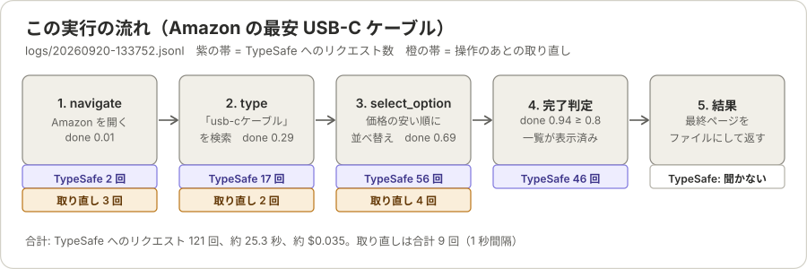

# 1 つのプロンプトを 1 ステップずつ追う（Amazon の最安 USB-C ケーブル）

> 先に [state-and-questions.md](state-and-questions.md) を参照してください。この文書は、その内容（state、question、候補の組み立て）を理解している前提で、1 つの目的を、実際の実行記録に沿って追います。仕組みの説明はそちらに任せ、ここには「この目的で、実際にどうだったか」だけを書きます。

```
https://www.amazon.co.jp/ で一番やすいusb-cケーブルをさがして
```

このプロンプトは [prompts/amazon-cheapest-usbc.txt](../prompts/amazon-cheapest-usbc.txt) にあります。

- 数値は `logs/20260920-133752.jsonl`（2026-09-20 13:37 の実行。`--headless`）から取ったものです。記録の置き場所は、今の既定では `~/.typesafe-auto-browsing/logs/` です（この実行のころは、実行した場所の `logs/`）。`seq` はその記録の通し番号です。ページの状態によって、実行ごとに変わります。
- この実行は約 25.3 秒、TypeSafe へのリクエストは 121 回、費用は約 $0.035 でした。結果は `goal achieved (p=0.94)` で成功です。
- 入力（state と questions）は、各ステップで**変わる所だけ**を載せます。`goal` は毎回同じで、`history` は直前までに実行した呼び出しです。全文は記録の `typesafe_request` にあります。

## 全体の流れ



| ステップ | 選ばれたツール | `page` の大きさ | `done` | TypeSafe へのリクエスト |
|---|---|---|---|---|
| 1 | `browser_navigate` | 58 文字（`about:blank`） | 0.01 | 2 回（`done` と `tool`、`url`） |
| 2 | `browser_type` | 104,814 文字 → 絞って 48,848 文字 | 0.29 | 17 回（絞り込み 13 回、`done` と `tool`、`submit` と `slowly` と `target`、`target` の決勝、`text`） |
| 3 | `browser_select_option` | 425,506 文字 → 絞って 49,065 文字 | 0.69 | 56 回（絞り込み 52 回、`done` と `tool`、`target`、`target` の決勝、`values`） |
| 4 | （なし。完了） | 363,098 文字 → 絞って 49,185 文字 | 0.94 | 46 回（絞り込み 45 回、`done` と `tool`） |

合計 121 回で、そのうち 110 回が長いページの絞り込み（C）です。ページが最後まで読み込まれた状態で判断するようになったため、どのステップでも、ページが 50,000 文字を超えています。

### 操作のあとの、ページの落ち着き待ち

ページを変える操作のあとは、`browser_snapshot` を、前回と同じ形になるまで取り直します（1 秒間隔、最大 5 回。比べるときは、`[ref=…]` と数字を除きます）。操作が、画面の更新の終わる前に戻るためです。

| 操作 | スナップショットの大きさ（文字。取った順） | 取り直し |
|---|---|---|
| `browser_navigate` | 42,756 → 75,650 → 104,814 → 104,814 | 3 回 |
| `browser_type` | 425,481 → 425,506 → 425,506 | 2 回 |
| `browser_select_option` | **26,204** → 361,134 → 363,188 → 363,098 → 363,098 | 4 回 |

- 並べ替えの直後は、一覧が空の 26,204 文字でした。取り直さずにこれで判断すると、`done` は、一覧のないページで出てしまいます。
- `browser_type` のあとには、残り時間のカウントダウンが 1 秒ごとに変わるページがありました。数字を無視して比べるので、2 回で落ち着いたと判定されています。

## 0. 起動

1. プロンプトを、**そのまま** `goal` にします。`-f` のファイルなら、`#` の行と空行だけを除いて連結します。
2. Playwright MCP を起動し、25 個のツールを受け取ります。
3. スキーマだけでは引数を選べないツールを、選択肢から外します。この実行では `browser_evaluate`（必須の `function` がコード）が外れ、24 個が残りました。

### この目的での `goal_candidates`

目的文は、7 つの語に切れます（同じ種類の文字が続く範囲。空白も区切り）。

```
[https://www.amazon.co.jp/] [で] [一番] [やすい] [usb-c] [ケーブル] [をさがして]
```

隣り合う語の連続範囲を、すべて候補にするので、7×8/2 = **28 個**です（`https://www.amazon.co.jp/`、`https://www.amazon.co.jp/ で`、…、`usb-cケーブル`、…、`をさがして`）。数字はないので、数値の候補はありません。文字列の質問の選択肢は、これに「(none of the above)」を足した 29 個です。

## 1. `browser_navigate`: サイトを開く

| | |
|---|---|
| 完了判定 | `done` = 0.01 |
| ツール選択 | `browser_navigate` 1.00（24 個の選択肢から） |
| 引数 `url` | goal の 28 候補から `https://www.amazon.co.jp/`（0.98） |
| 実行 | `browser_navigate {"url": "https://www.amazon.co.jp/"}` |

```
seq 6   state:  history = ["(nothing done yet)"]、page = about:blank のスナップショット（58 文字）
        questions: done（Noul）、tool（Choice、24 個）
        答え:   done 0.01、tool = browser_navigate 1.00

seq 9   state:  next_action = {"tool": "browser_navigate"}
        questions: url:0（Choice、29 個）
        答え:   https://www.amazon.co.jp/ （0.98）
```

`url` の質問文は、「値そのものだけの最短の候補を選ぶ。指示語（どのサイトを使うか、何をするか）は含めない」です。全部入りの `https://www.amazon.co.jp/ で一番やすい…` ではなく、URL だけが選ばれています。

## 2. `browser_type`: 検索語を入れて送信する

| | |
|---|---|
| ページ | Amazon のトップ 104,814 文字（50,000 文字を超えるので、C で絞る） |
| 絞り込み（C） | 13 パート → `[0, 1, 5, 9, 10, 11]`（48,848 文字）。確率は part 0 が 0.95、part 10 が 0.74 |
| 完了判定 | `done` = 0.29 |
| ツール選択 | `browser_type`（確信度 0.56。次点は `browser_find` の確率 0.25） |
| 引数 `submit` | Noul → 0.74（0.5 以上なので true） |
| 引数 `slowly` | Noul → 0.43（必須でなく 0.5 未満なので、指定しない） |
| 引数 `target` | `[ref]` 387 個 → 254 個と 133 個の 2 つの塊 → 勝者 `e90`（0.99）と `e840`（0.25）で決勝 → `e90`（1.00） |
| 引数 `text` | goal の 28 候補から `usb-cケーブル`（0.60） |
| 実行 | `browser_type {"submit": true, "target": "e90", "text": "usb-cケーブル"}` |

```
seq 24〜43  state:  history = [navigate]、page = パート 1 つ（約 8,000 文字）
            questions: outcome（Noul）、control（Noul）

seq 52  state:  history = [navigate]、page = 48,848 文字
        questions: done（Noul）、tool（Choice、24 個）
        答え:   done 0.29、tool = browser_type 0.56

seq 55  state:  next_action = "browser_type"
        questions: submit（Noul）、slowly（Noul）、target:0（254 個）、target:1（133 個）
        答え:   submit 0.74、slowly 0.43、target:0 → e90（0.99）、target:1 → e840（0.25）

seq 57  questions: target（2 個 = e90, e840）　答え: e90（1.00）

seq 61  state:  next_action = {"tool": "browser_type", "submit": true, "target": "e90"}
        questions: text:0（Choice、29 個 = goal の 28 候補 + 該当なし）
                   text@page:0（Choice、156 個 = ページの名前 155 個 + 該当なし）
        答え:   text:0 → usb-cケーブル（0.60）、text@page:0 → 該当なし（0.90）
```

- `text` は、`target` が決まったあとに聞いています（入れる文字列は入力欄で変わるため）。
- 目的文側で値が決まったので、ページ側の答えは使いません。
- `usb-cケーブル`（0.62）が選ばれ、`一番やすいusb-cケーブル`（0.14）、`usb-c`（0.07）は選ばれませんでした。「一番やすい」は検索語ではなく、指示です。
- 実行結果は、Playwright MCP のコードで返ります。

  ```js
  await page.getByRole('searchbox', { name: 'Amazon.co.jpを検索' }).fill('usb-cケーブル');
  await page.getByRole('searchbox', { name: 'Amazon.co.jpを検索' }).press('Enter');
  ```

  ページは `https://www.amazon.co.jp/s?k=usb-c…` の検索結果に移りました。

## 3. `browser_select_option`: 「価格: 安い順」に並べ替える

### 3.1 長いページを絞る（C）

| | |
|---|---|
| ページ | 検索結果 425,506 文字 |
| 分割 | 約 8,000 文字ずつの 52 パート |
| パートごとの質問 | `outcome` と `control`（Noul）。52 回、同時に 8 つずつ |
| 確率（大きいほう） | 52 パートのうち 51 個が 0.2 以上、**38 個が 0.8 以上**。最上位は part 1（0.93）、次が part 35（0.88）、part 19 と part 40（0.87） |
| 採用 | 確率の高い順に、50,000 文字に収まるまで → `[1, 8, 19, 23, 35, 40]`（49,065 文字） |

```
seq 74〜169  state:  history = [navigate, type]、page = パート 1 つ（約 8,000 文字）
             questions: outcome（Noul）、control（Noul）
```

- ほとんどのパートが高い確率になりました（検索結果のページで、どのパートにも商品が並んでいるため、と考えられます）。採用は、確率のわずかな差と、50,000 文字の上限で決まっています。
- 並べ替えの選択欄（`combobox "並べ替え::" [ref=f2e255]`）は part 1 にあり、`control` が 0.93 でした。だから、最上位で採用されています。

### 3.2 ツールと引数（A と B）

| | |
|---|---|
| 完了判定 | `done` = 0.69（閾値 0.8 に届かず、続ける） |
| ツール選択 | `browser_select_option`（確信度 0.69。次点は `browser_click` の確率 0.19） |
| 引数 `target` | `[ref]` 332 個 → 254 個と 78 個の 2 つの塊 → 勝者 `f2e255`（1.00）と `f2e4101`（0.18）で決勝 → `f2e255`（1.00） |
| 引数 `values` | `f2e255` の配下の `option` 6 個 → `価格: 安い順`（0.99） |
| 実行 | `browser_select_option {"target": "f2e255", "values": ["価格: 安い順"]}` |

```
seq 180  state:  history = [navigate, type]、page = 49,065 文字（3.1 の結果）
         questions: done（Noul）、tool（Choice、24 個）
         答え:   done 0.69、tool = browser_select_option 0.69

seq 183  state:  next_action = "browser_select_option"
         questions: target:0（254 個）、target:1（78 個）
         答え:   target:0 → f2e255（1.00）、target:1 → f2e4101（0.18）
seq 185  questions: target（2 個）　答え: f2e255（1.00）

seq 188  state:  next_action = {"tool": "browser_select_option", "target": "f2e255"}
         questions: values:0（Choice、7 個 = option 6 個 + 該当なし）
         答え:   価格: 安い順（0.99）
```

`f2e255` は、TypeSafe に見せたページの、次の要素です。

```
combobox "並べ替え::" [ref=f2e255]:
  option "おすすめ"
  option "価格: 安い順"
  option "価格: 高い順"
  option "標準的なカスタマーレビュー"
  option "新着商品"
  option "ベストセラー"
```

- `values` の選択肢は、goal の候補ではなく、選んだ要素の下の `option` です。goal の候補は入りません。
- 「やすい」を「安い順」に結びつけたのは、コードではなく TypeSafe です。コードには、その対応がありません。
- 実行結果は `page.getByLabel('並べ替え::').selectOption('価格: 安い順')` で、URL に `s=price-asc-rank` が付きました。

## 4. 完了判定

| | |
|---|---|
| ページ | 363,098 文字（落ち着いたあと。50,000 文字を超えるので、C で絞る） |
| 絞り込み（C） | 45 パート → `[2, 3, 10, 19, 23, 25]`（49,185 文字）。43 個が 0.2 以上、31 個が 0.8 以上 |
| 完了判定 | `done` = 0.94 ≥ `done_threshold`（0.8） |
| 同時に選ばれたツール | `browser_click`（0.71）。ただし、完了が先に判定されるので、実行されない |

`history` が空でなく、`done` が閾値以上なので、成功で終わります。

## 5. 結果

最後のスナップショット（`done` を判定したページ）を `final-snapshot.yml` に保存し、そのパスを `--json` の `page.snapshot` で返します。

```json
{
  "success": true,
  "reason": "goal achieved (p=0.94)",
  "page": {
    "url": "https://www.amazon.co.jp/s?k=usb-c…&s=price-asc-rank&…",
    "title": "Amazon.co.jp: Usb-cケーブル",
    "snapshot": "/Users/…/logs/20260920-133752/final-snapshot.yml"
  }
}
```

このファイルには、並べ替えたあとの商品の一覧が入っています（363,098 文字。価格の `￥` が 222 件、商品リンクが 232 件）。落ち着き待ちを入れる前の実行（13:14）では、並べ替えの直後の、一覧が空のページ（26,223 文字、`￥` が 0 件）が返っていました。

## この目的で分かったこと

- **goal の使われ方は 2 通りです。**
  - 候補としてコピーされる（`url`、`text`）: `goal_candidates` の 28 個から TypeSafe が選び、コードが選ばれた文字列を写す。
  - 意味を読まれる（ツール選択、`done`、`values`）: `goal` の全文が state に入り、TypeSafe が意味を読んで選ぶ。
- **「並べ替えは価格の安い順」という手順は、どこにも書かれていません。** ページにその選択肢があり、TypeSafe が選んだだけです。別のサイトで、同じ選択肢がなければ成立しません。
- **引数の値は、目的文の部分文字列か、ページのテキストです。** 作った文字列は 1 つもありません。
- **`browser_select_option` のあとは、スナップショットを取るのが早すぎました。** Playwright MCP の `select_option` には、操作のあとの待ちがなく（0.1 秒で戻る）、直後のスナップショットは一覧が空でした。落ち着くまで取り直すことで、一覧のあるページで `done` を判定できています。
- **長いページの絞り込みが、費用の大半を占めます。** 121 回のうち 110 回です。しかも、確率がほとんどのパートで高く、採用は上限の 50,000 文字で決まっているので、絞り込みとしては決め手になっていません。
- **並べ替えの成否を確かめる処理はありません。** 1 回の `browser_select_option` のあとは、完了判定（`done`）に委ねています。
- **結果は、最終ページの 1 枚だけです。** 商品の詳細ページには移動しません。
